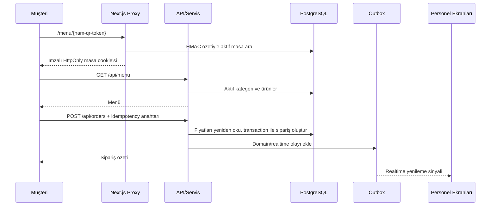
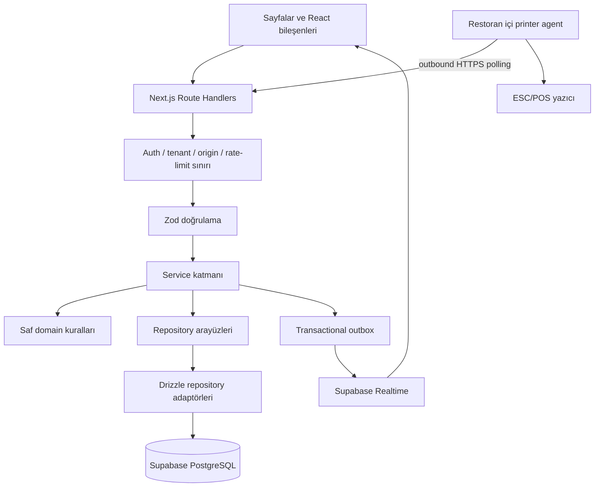

# Tarihi Şehir Lokantası — Kapsamlı Proje Dokümantasyonu

> **Belge durumu:** 25 Ağustos 2026 tarihinde mevcut çalışma ağacındaki kaynak kod incelenerek hazırlanmıştır.
> **Kapsam:** Ürün amacı, kullanıcı rolleri, tüm uygulama yüzeyleri, mimari, veri modeli, API'ler, güvenlik, gerçek zamanlı veri, yazdırma, test, kurulum, dağıtım, işletim ve bilinen sınırlar.
> **Güvenlik notu:** Bu belgede hiçbir gerçek parola, token, bağlantı dizesi veya `.env.local` değeri bulunmaz.

## İçindekiler

1. [Projenin özeti](#1-projenin-özeti)
2. [Ürün kapsamı ve kullanıcılar](#2-ürün-kapsamı-ve-kullanıcılar)
3. [Uçtan uca iş akışları](#3-uçtan-uca-iş-akışları)
4. [Teknoloji yığını](#4-teknoloji-yığını)
5. [Mimari ve katmanlar](#5-mimari-ve-katmanlar)
6. [Dizin ve dosya yapısı](#6-dizin-ve-dosya-yapısı)
7. [Sayfalar ve arayüzler](#7-sayfalar-ve-arayüzler)
8. [Bileşen sistemi ve görsel yapı](#8-bileşen-sistemi-ve-görsel-yapı)
9. [API kataloğu](#9-api-kataloğu)
10. [Veritabanı ve veri modeli](#10-veritabanı-ve-veri-modeli)
11. [Domain kuralları](#11-domain-kuralları)
12. [Kimlik doğrulama ve yetkilendirme](#12-kimlik-doğrulama-ve-yetkilendirme)
13. [Güvenlik modeli](#13-güvenlik-modeli)
14. [Realtime ve transactional outbox](#14-realtime-ve-transactional-outbox)
15. [Ödeme, hesap bölme ve kasa vardiyası](#15-ödeme-hesap-bölme-ve-kasa-vardiyası)
16. [Yazdırma sistemi](#16-yazdırma-sistemi)
17. [Çoklu dil ve döviz](#17-çoklu-dil-ve-döviz)
18. [Ortam değişkenleri](#18-ortam-değişkenleri)
19. [Kurulum ve geliştirme](#19-kurulum-ve-geliştirme)
20. [Test stratejisi](#20-test-stratejisi)
21. [Dağıtım ve operasyon](#21-dağıtım-ve-operasyon)
22. [Veri saklama, yedekleme ve kurtarma](#22-veri-saklama-yedekleme-ve-kurtarma)
23. [Hata yönetimi ve gözlemlenebilirlik](#23-hata-yönetimi-ve-gözlemlenebilirlik)
24. [Bilinen sınırlar ve açık kararlar](#24-bilinen-sınırlar-ve-açık-kararlar)
25. [Geliştirici çalışma rehberi](#25-geliştirici-çalışma-rehberi)
26. [Kavram sözlüğü](#26-kavram-sözlüğü)

---

## 1. Projenin özeti

Tarihi Şehir Lokantası, tek bir lokantanın müşteri ve operasyon süreçlerini aynı merkezi sistemde birleştiren, çok kiracılı çalışmaya uygun tasarlanmış bir restoran yönetim uygulamasıdır. Müşteri masadaki QR kodu tarayarak menüye girer, ürün seçer, sipariş verir, aktif siparişini izler, garson çağırır veya hesap ister. Personel tarafında garson, mutfak, kasa ve yönetim panelleri aynı PostgreSQL veritabanını kullanır.

Sistem yalnız bir “QR menü” değildir. Mevcut kapsam şunları içerir:

- QR token doğrulama ve masaya bağlı müşteri oturumu,
- kategori ve ürün bazlı dijital menü,
- müşteri ve personel tarafından sipariş oluşturma,
- siparişe sonradan ürün ekleme,
- mutfak hazırlık akışı,
- garson çağrıları ve hesap talepleri,
- masa taşıma, birleştirme ve güvenli sıfırlama,
- ürün iptali ve servis edilmiş ürünün gerekçeli void işlemi,
- hesap bölme ve çoklu ödeme,
- nakit, kart ve diğer ödeme yöntemleri,
- ödeme iadesi,
- kasa, vardiya, para giriş/çıkışı, X ve Z raporu,
- yönetim panelinden menü, masa, personel, ayar, yazıcı ve rapor yönetimi,
- ESC/POS fiziksel yazıcı kuyruğu ve yerel yazıcı ajanı,
- Supabase Realtime tabanlı ekran yenileme sinyalleri,
- audit log, idempotency, rate limit ve tenant izolasyonu,
- veri saklama/temizlik ve kurtarma runbook'ları,
- PWA manifesti ve mobil uyumlu arayüz.

### Güncel kod tabanı özeti

| Ölçü | Güncel değer |
| --- | ---: |
| Uygulama sayfası | 25 |
| API route dosyası | 86 |
| Veritabanı tablosu | 61 (production `public` şemasındaki base table sayısı; `db/schema.ts` 31 + `db/erp-schema.ts` 30 tanım) |
| SQL migration | 20 ledger kaydı (`0000`–`0019`) |
| Menü locale dosyası | 109 |
| React bileşeni | 81 |
| Foundation test dosyası | 83 |
| Integration test dosyası | 31 |
| Yazıcı ajanı test paketi | 1 ayrı paket |

Bu sayılar dosya sayısıdır; tek test dosyasında birden fazla test vakası, tek API route dosyasında birden fazla HTTP metodu bulunabilir.

---

## 2. Ürün kapsamı ve kullanıcılar

### 2.1 Müşteri

Müşteri hesabı açmaz. Yetkisi, taradığı masanın QR tokenının doğrulanmasıyla oluşan kısa ömürlü, imzalı ve HttpOnly masa oturumundan gelir.

Müşteri şunları yapabilir:

- masaya özel menüyü görüntüleme,
- dil ve gösterim para birimi seçme,
- kategori/ürün gezinme ve ürün detayını açma,
- sepet oluşturma ve not ekleme,
- sipariş gönderme,
- aktif sipariş ve durum zaman çizelgesini görme,
- garson çağırma,
- hesap isteme.

Müşteri fiyat, restoran kimliği veya masa kimliği belirleyemez. Bunların tümü sunucuda oturumdan ve veritabanından çözülür.

### 2.2 Garson (`WAITER`)

Garson aşağıdaki operasyonları yürütür:

- salon ve masa durumunu izleme,
- masaya sipariş açma veya açık siparişe ürün ekleme,
- yeni siparişi onaylama,
- hazır ürünü servis edildi olarak işaretleme,
- uygun aşamadaki ürün/sipariş iptali,
- garson çağrısını üstlenme veya çözme,
- masa notu/servis isteği oluşturma,
- masa taşıma, birleştirme ve güvenli reset işlemlerini rol kuralları dahilinde yürütme.

### 2.3 Mutfak (`KITCHEN`)

Mutfak panosu sipariş kalemlerinden türetilen gerçek işi gösterir:

- bekleyen kalemi hazırlamaya alma,
- hazırlanan kalemi hazır yapma,
- yanlış geçişi sınırlı biçimde geri alma (`PREPARING → PENDING`, `READY → PREPARING`),
- iptal veya void edilmiş kalemleri iş yükünden ayırma,
- sonradan eklenen ürünleri tekrar mutfak kuyruğuna taşıma.

### 2.4 Kasa (`CASHIER`)

Kasa yüzeyi:

- servis edilmiş siparişleri ve ödeme defterini görüntüler,
- hesap oluşturur/böler/düzenler,
- ürünleri hesaplara dağıtır,
- nakit, kart veya diğer yöntemle kısmi/tam ödeme alır,
- gerekçeli iade yapar,
- kasa vardiyası açar/kapatır,
- nakit giriş/çıkışı kaydeder,
- X raporu (anlık) ve Z raporu (kapanış snapshotı) üretir.

### 2.5 Yönetici ve müdür (`ADMIN`, `MANAGER`)

Yönetim yüzeyi:

- dashboard ve gelişmiş raporlar,
- kategori/ürün CRUD ve ürün görseli yükleme,
- masa ve QR token yaşam döngüsü,
- personel hesabı, rolü, aktifliği ve parola kurulum/reset akışı,
- restoran ayarları,
- kasa tanımları,
- yazıcı ajanı, fiziksel yazıcı, yönlendirme ve print job yönetimi,
- dead-letter outbox olaylarını yeniden kuyruğa alma,
- sipariş ve finansal inceleme ekranları sağlar.

### 2.6 Rol–panel matrisi

| Panel | İzinli roller |
| --- | --- |
| `/admin/*` | `ADMIN`, `MANAGER` |
| `/staff/*` | `ADMIN`, `MANAGER`, `WAITER` |
| `/kitchen` | `ADMIN`, `MANAGER`, `KITCHEN` |
| `/cashier` | `ADMIN`, `MANAGER`, `CASHIER` |

Bu matris `lib/auth/role-access.ts` içinde merkezi olarak tutulur. UI'da butonu gizlemek tek başına güvenlik sayılmaz; aynı kural sunucu layout'larında ve API handler'larında yeniden uygulanır.

---

## 3. Uçtan uca iş akışları

### 3.1 Müşteri sipariş akışı



Önemli ayrıntılar:

1. Ham QR token veritabanında saklanmaz; HMAC özeti saklanır.
2. QR doğrulandıktan sonra istemci, token yerine masa-bound cookie kullanır.
3. Sepetteki fiyat yalnız sunum bilgisidir; tahsil edilecek fiyat DB'den alınır.
4. Sipariş ve outbox olayı aynı transaction içinde yazılır.
5. Aynı istek yeniden gönderilirse idempotency çift siparişi engeller.

### 3.2 Operasyon yaşam döngüsü

```text
Müşteri/Garson sipariş açar
        ↓
NEW → CONFIRMED → PREPARING → READY → SERVED → COMPLETED
  ↘ CANCELLED      ↘ CANCELLED  ↘ CANCELLED
        ↓
Kalemler mutfakta ayrı ayrı ilerler
        ↓
Kasa hesap/ödeme alır
        ↓
Tam tahsilat ve uygun durum sonrası sipariş kapanır
        ↓
Masa temizlik/uygunluk akışına döner
```

### 3.3 Masa işlemleri

- **Taşıma:** Açık iş bir kaynak masadan boş hedef masaya taşınır. Müşteri QR oturumu taşınmaz.
- **Birleştirme:** İki masanın sipariş kimlikleri korunur; finansal kayıtlar tek satıra ezilmez.
- **Reset:** Yalnız güvenli koşullar altında masa operasyonel başlangıç durumuna alınır; ödeme geçmişi silinmez.
- **QR rotate:** Yeni token yalnız bir kez gösterilir, eski token anında geçersizleşir.
- **QR revoke:** Masa tokenı iptal edilir; yeni QR üretilene kadar erişim kapalıdır.

### 3.4 Kasa kapanış akışı

1. Personel bir kasa seçerek açılış nakdiyle vardiya açar.
2. Ödemeler ve iadeler vardiyaya bağlanır.
3. Gerektiğinde gerekçeli `CASH_IN`/`CASH_OUT` hareketi eklenir.
4. X raporu vardiyanın değişebilir anlık görünümünü verir.
5. Kapanışta sayılan nakit girilir.
6. Beklenen nakit, sayılan nakit ve fark transaction içinde sabitlenir.
7. Z raporu sürümlü JSON snapshot olarak kapalı vardiyada saklanır; sonradan yeniden hesaplanarak geçmiş değiştirilmez.

---

## 4. Teknoloji yığını

| Alan | Teknoloji | Projedeki rolü |
| --- | --- | --- |
| Framework | Next.js `16.3.0` App Router | Sayfalar, Server Components, Route Handlers, Proxy |
| UI çalışma zamanı | React `19.2.8` | Etkileşimli bileşenler ve client state |
| Dil | TypeScript 5 | Uçtan uca tip güvenliği |
| Stil | Tailwind CSS 4 | Utility tabanlı tasarım sistemi |
| UI altyapısı | Base UI, shadcn, CVA | Erişilebilir primitive ve varyantlar |
| İkon | Lucide React | Arayüz ikonları |
| Grafik | Recharts 3 | Yönetim rapor grafikleri |
| Bildirim | Sonner | Toast bildirimleri |
| Veritabanı | PostgreSQL / Supabase | Merkezi ve kalıcı veri kaynağı |
| ORM | Drizzle ORM + Drizzle Kit | Şema, sorgu ve migration üretimi |
| Auth | Supabase Auth | Personel kimliği ve session yenileme |
| Realtime | Supabase Realtime | Personel ekranlarına yenileme sinyali |
| Doğrulama | Zod 4 | Request ve ortam değişkeni doğrulama |
| Yazdırma | ESC/POS + Node printer agent | Yerel ağ yazıcılarına güvenli çıktı |
| Test | Node test runner + TSX | Foundation, integration ve agent testleri |
| Dağıtım | Vercel uyumlu | Next.js runtime ve cron dispatcher |

`next.config.ts`, üretimde güvenlik başlıkları ve Turbopack kökü tanımlar. Next.js 16'da eski “middleware” kavramı `proxy.ts` olarak kullanılır; proje bu yeni konvansiyona uygundur.

---

## 5. Mimari ve katmanlar



### 5.1 Sunum katmanı

`app/` route ağacını, `components/` ise tekrar kullanılabilir arayüz parçalarını barındırır. Sunucu bileşenleri ilk veri/erişim kararlarını, client bileşenleri etkileşim ve periyodik yenilemeyi yürütür.

### 5.2 API katmanı

`app/api/**/route.ts` dosyaları Web `Request`/`Response` tabanlı Next.js Route Handler'lardır. Görevleri:

- principal ve masa bağlamını çözmek,
- origin/rate-limit/rol kontrolü yapmak,
- Zod ile girdiyi doğrulamak,
- servisi çağırmak,
- ortak API zarfı ve doğru HTTP durumunu döndürmektir.

İş mantığı mümkün olduğunca route dosyasında tutulmaz.

### 5.3 Domain katmanı

`lib/domain/`, framework ve veritabanından bağımsız iş kurallarını içerir: para aritmetiği, durum makineleri, masa eylemleri, rapor aralıkları, idempotency parmak izi, ESC/POS belge modeli ve finansal kurallar.

### 5.4 Service katmanı

`lib/services/` use-case katmanıdır. Transaction sınırları, kilitleme, repository koordinasyonu, audit/outbox yazımı ve iş kuralı hataları burada yönetilir. Başlıca servis grupları:

- menü ve müşteri sorguları,
- sipariş ve hesap yönetimi,
- ödeme/iade,
- personel sipariş/çağrı/masa işlemleri,
- admin menü/personel/ayar/raporları,
- kasa/vardiya/rapor,
- yazıcı ve print job,
- outbox dispatch,
- veri bakım/retention.

### 5.5 Repository katmanı

`lib/repositories/*-repository.ts` dosyaları port/arayüzleri, `drizzle-*-repository.ts` dosyaları PostgreSQL uygulamalarını tanımlar. Bu ayrım servisleri test doubles ile sınamayı ve SQL ayrıntılarını use-case'lerden ayırmayı sağlar.

### 5.6 Adaptör ve view model katmanı

`lib/adapters/` API/domain nesnelerini menü ve personel ekranlarının beklediği yapılara dönüştürür. `lib/hooks/use-api-resource.ts`, istemci tarafında abort, focus revalidation ve polling içeren ortak veri alma davranışıdır.

---

## 6. Dizin ve dosya yapısı

```text
sehir-lokantasi/
├── app/                     Next.js sayfaları, layout'lar ve API route'ları
│   ├── (auth)/              Personel login ve parola kurulum sayfaları
│   ├── admin/               Yönetim paneli
│   ├── api/                 86 Route Handler dosyası
│   ├── menu/[tableToken]/   QR ile açılan müşteri menüsü
│   ├── staff/               Garson/personel paneli
│   ├── cashier/             Kasa paneli
│   └── kitchen/             Mutfak panosu
├── components/
│   ├── admin/               18 yönetim bileşeni
│   ├── cashier/             6 kasa bileşeni
│   ├── kitchen/             Mutfak board'u
│   ├── menu/                14 müşteri menüsü bileşeni
│   ├── shared/              10 ortak bileşen
│   ├── staff/               17 personel bileşeni
│   └── ui/                  15 temel UI primitive'i
├── db/
│   ├── schema.ts            Canonical Drizzle şeması
│   ├── relations.ts         Drizzle ilişkileri
│   ├── migrations/          Sürümlü SQL migration'lar
│   ├── seed-data/           Geliştirme fixture'ları
│   ├── migrate.ts           Migration çalıştırıcı
│   └── seed.ts              Korumalı geliştirme seed'i
├── lib/
│   ├── adapters/            View model dönüşümleri
│   ├── api/                 Ortak route/client/response yardımcıları
│   ├── auth/                Kimlik, rol, session ve principal çözümleme
│   ├── config/              Döviz ve retention yapılandırması
│   ├── domain/              Saf iş kuralları
│   ├── env/                 Ortam değişkeni doğrulama
│   ├── i18n/                109 dil kataloğu
│   ├── realtime/            Olay yayınlama ve istemci aboneliği
│   ├── repositories/        Portlar ve Drizzle adaptörleri
│   ├── security/            Token, rate limit, origin ve log güvenliği
│   ├── services/            Uygulama use-case'leri
│   ├── supabase/            Browser/server/admin Supabase istemcileri
│   └── validation/          Zod request şemaları
├── public/                  Marka, yemek, bayrak, döviz ve PWA görselleri
├── reference/               Tasarım ve ürün görseli referans arşivi
├── scripts/                 Bootstrap, session ve i18n araçları
├── tests/
│   ├── foundation/          DB'siz veya kontrollü birim/kontrat testleri
│   ├── integration/         Gerçek test DB/Auth/HTTP akışları
│   └── agent/               Yazıcı ajanı testleri
├── tools/printer-agent/     Restoran içinde çalışan ayrı Node süreci
├── docs/                    Konu bazlı teknik runbook'lar
├── proxy.ts                 CSP, QR gate ve kaba auth kontrolü
├── next.config.ts           Next.js ve güvenlik başlıkları
├── vercel.json              fra1 region (cron tanımı yok; outbox zamanlaması Supabase'de)
└── package.json             Script ve bağımlılıklar
```

`reference/` çalışma zamanı için ana kaynak değildir; canlı UI ekran kayıtları, durum varyantları ve kategori ürün görsel referansları içerir. `tmp/` geçici üretim çıktıları içindir.

---

## 7. Sayfalar ve arayüzler

### 7.1 Genel ve müşteri sayfaları

| URL | Dosya | Amaç |
| --- | --- | --- |
| `/` | `app/page.tsx` | Marka ve mevcut yüzeylere portal; demo launcher açıksa demo masası başlatır |
| `/menu/[tableToken]` | `app/menu/[tableToken]/page.tsx` | Doğrulanmış masa için müşteri menüsü |
| `/menu/invalid` | `app/menu/invalid/page.tsx` | Geçersiz/iptal edilmiş QR veya masa erişimi hata ekranı |

### 7.2 Personel kimlik sayfaları

| URL | Amaç |
| --- | --- |
| `/staff/login` | Supabase Auth personel girişi |
| `/staff/set-password` | Tek kullanımlık kurulum/reset bağlantısından parola belirleme |

### 7.3 Garson/personel sayfaları

| URL | Amaç |
| --- | --- |
| `/staff/dashboard` | Personel özeti ve hızlı operasyon görünümü |
| `/staff/tables` | Masa grid'i, sipariş pad'i ve masa işlemleri |
| `/staff/orders` | Aktif sipariş listesi ve durum eylemleri |
| `/staff/calls` | Garson çağrıları, hesap talepleri ve çözüm akışı |

### 7.4 Operasyon panelleri

| URL | Amaç |
| --- | --- |
| `/kitchen` | Mutfak iş kuyruğu ve kalem durum yönetimi |
| `/cashier` | Hesap, ödeme, iade, vardiya ve rapor işlemleri |

### 7.5 Yönetim sayfaları

| URL | Amaç |
| --- | --- |
| `/admin` | Admin giriş route'u/ana yönlendirme |
| `/admin/dashboard` | Yönetim KPI ve özetleri |
| `/admin/menu` | Menü genel görünümü |
| `/admin/categories` | Kategori yönetimi |
| `/admin/products` | Ürün, fiyat, stok ve görsel yönetimi |
| `/admin/tables` | Masa CRUD ve durum yönetimi |
| `/admin/qr-codes` | QR üretme, rotate ve revoke işlemleri |
| `/admin/orders` | Sipariş yönetimi ve inceleme |
| `/admin/staff` | Personel ve rol yönetimi |
| `/admin/settings` | Restoran ayarları |
| `/admin/reports` | Gelişmiş satış/operasyon raporları |
| `/admin/cash-reports` | Günlük kasa raporu |
| `/admin/cash-registers` | Fiziksel/mantıksal kasa tanımları |
| `/admin/printers` | Yazıcı ajanı, cihaz, rota ve iş kuyruğu yönetimi |

`app/loading.tsx`, `app/error.tsx`, `app/global-error.tsx` ve admin'e özel loading/error dosyaları bekleme ve hata sınırlarını sağlar.

---

## 8. Bileşen sistemi ve görsel yapı

### 8.1 Müşteri menüsü

`components/menu/` altında:

- splash intro,
- restoran başlığı,
- kategori grid'i,
- ürün kartı ve ürün detay sheet'i,
- sepet kalemi,
- alt navigasyon,
- sipariş durum zaman çizelgesi,
- dil ve döviz seçicileri,
- menü tercih provider'ı,
- boş/hata durum kartları bulunur.

### 8.2 Personel ve operasyon

`components/staff/` salon grid'i, masa kartları, sipariş composer, operasyon paneli, çağrı/sipariş listeleri, session provider ve realtime durum göstergesini içerir. `components/kitchen/kitchen-board.tsx` mutfak kolonlarını yönetir. `components/cashier/` hesap bölme, ürün dağıtma, vardiya ve rapor dialog'larını içerir.

### 8.3 Admin

Admin bileşenleri route bazlı manager yapısındadır. Ortak `use-admin-*` hook'ları API veri kaynağını, manager bileşenleri form/list/dialog davranışını yürütür. Rapor ekranları Recharts ile grafik ve drilldown sheet'leri kullanır.

### 8.4 Tasarım sistemi

- Ana gövde fontu: **Manrope**.
- Serif vurgu/marka fontu: **Lora**.
- Tema rengi: `#30382D` zeytin tonu.
- PWA arka plan rengi: `#120C08`.
- Global stiller: `app/globals.css`.
- Primitive'ler: button, input, textarea, select, switch, dialog, sheet, tabs, table, card, badge, avatar, skeleton, separator ve toaster.
- Animasyon davranışı ortak motion platformu ve `use-reveal-once` ile toplanır.

Root layout Türkçe (`lang="tr"`), mobil viewport, Apple web app bilgileri ve global toaster tanımlar.

---

## 9. API kataloğu

Tüm endpoint'ler Next.js App Router Route Handler olarak `app/api/` altındadır. Aşağıdaki yöntemler kaynak dosyalardaki export'larla eşleşir.

### 9.1 Müşteri ve ortak endpoint'ler

| Method | Endpoint | Görev |
| --- | --- | --- |
| `POST` | `/api/table-sessions` | QR doğrulama sonrası masa sessionı oluşturma |
| `GET` | `/api/menu` | Oturumdaki restoran/masa için aktif menü |
| `POST` | `/api/orders` | Müşteri siparişi oluşturma |
| `GET` | `/api/orders/active` | Masanın aktif siparişlerini getirme |
| `POST` | `/api/calls` | Garson çağrısı oluşturma |
| `POST` | `/api/bill-requests` | Hesap talebi oluşturma |
| `GET` | `/api/exchange-rates` | TRY tabanlı gösterim kurları |
| `GET` | `/api/health` | Sınırlı uygulama sağlık kontrolü |

### 9.2 Personel ve mutfak endpoint'leri

| Method | Endpoint | Görev |
| --- | --- | --- |
| `POST` | `/api/staff/login` | Personel girişi |
| `POST` | `/api/staff/logout` | Oturumu kapatma |
| `POST` | `/api/staff/set-password` | Kurulum/reset parolası belirleme |
| `GET` | `/api/staff/menu` | Personel sipariş pad'i menüsü |
| `GET`, `POST` | `/api/staff/orders` | Siparişleri listeleme / personel siparişi açma |
| `GET`, `POST` | `/api/staff/calls` | Çağrıları listeleme / servis isteği açma |
| `PATCH` | `/api/staff/calls/[callId]` | Çağrı üstlenme/çözme/durum değiştirme |
| `GET` | `/api/staff/tables` | Salon ve masa durumu |
| `POST` | `/api/staff/tables/[tableId]/transfer` | Masayı taşıma |
| `POST` | `/api/staff/tables/[tableId]/reset` | Masayı güvenli sıfırlama |
| `POST` | `/api/staff/tables/merge` | İki masayı birleştirme |
| `PATCH` | `/api/orders/[orderId]/status` | Sipariş durum geçişi |
| `PATCH` | `/api/order-items/[orderItemId]/status` | Sipariş kalemi durum geçişi |
| `POST` | `/api/orders/[orderId]/items` | Açık siparişe ürün ekleme |
| `POST` | `/api/orders/[orderId]/cancel` | Siparişi gerekçeli iptal etme |
| `POST` | `/api/orders/[orderId]/items/[orderItemId]/cancel` | Hazırlık öncesi/uygun kalemi iptal etme |
| `POST` | `/api/orders/[orderId]/items/[orderItemId]/void` | Servis edilmiş kalemi finansal kayıttan gerekçeli düşme |

### 9.3 Hesap, ödeme ve kasa endpoint'leri

| Method | Endpoint | Görev |
| --- | --- | --- |
| `GET`, `POST` | `/api/orders/[orderId]/checks` | Hesapları listeleme / bölünmüş hesap oluşturma |
| `PATCH`, `DELETE` | `/api/orders/[orderId]/checks/[checkId]` | Hesabı düzenleme / uygun açık hesabı kaldırma |
| `GET` | `/api/orders/[orderId]/ledger` | Sipariş finansal defteri |
| `POST` | `/api/payments` | Kısmi veya tam ödeme kaydı |
| `POST` | `/api/payments/[paymentId]/refund` | Gerekçeli ödeme iadesi |
| `GET`, `POST` | `/api/cashier/shifts` | Vardiyaları listeleme / vardiya açma |
| `GET` | `/api/cashier/shifts/current` | Kullanıcının mevcut açık vardiyası |
| `GET` | `/api/cashier/shifts/[shiftId]` | Vardiya detayı |
| `POST` | `/api/cashier/shifts/[shiftId]/movements` | Nakit giriş/çıkış hareketi |
| `POST` | `/api/cashier/shifts/[shiftId]/close` | Vardiyayı sayım ile kapatma |
| `GET` | `/api/cashier/shifts/[shiftId]/x-report` | Anlık X raporu |
| `GET` | `/api/cashier/shifts/[shiftId]/z-report` | Saklanmış Z raporu |

### 9.4 Admin katalog, masa, personel ve ayar endpoint'leri

| Method | Endpoint | Görev |
| --- | --- | --- |
| `GET` | `/api/admin/menu` | Admin menü modeli |
| `POST` | `/api/admin/categories` | Kategori oluşturma |
| `PATCH` | `/api/admin/categories/[categoryId]` | Kategori güncelleme/soft delete |
| `POST` | `/api/admin/products` | Ürün oluşturma |
| `PATCH` | `/api/admin/products/[productId]` | Ürün/fiyat/uygunluk güncelleme |
| `POST` | `/api/admin/products/[productId]/image` | Ürün görseli yükleme |
| `POST` | `/api/admin/tables` | Masa oluşturma |
| `PATCH` | `/api/admin/tables/[tableId]` | Masa güncelleme |
| `POST` | `/api/admin/tables/[tableId]/qr/rotate` | QR token yenileme |
| `POST` | `/api/admin/tables/[tableId]/qr/revoke` | QR token iptali |
| `GET`, `POST` | `/api/admin/staff` | Personel listeleme / oluşturma |
| `GET`, `PATCH` | `/api/admin/staff/[staffId]` | Personel detayı / rol-aktiflik güncelleme |
| `POST` | `/api/admin/staff/[staffId]/password-reset` | Tek kullanımlık parola bağlantısı üretme |
| `GET`, `PATCH` | `/api/admin/settings` | Restoran ayarlarını okuma/güncelleme |
| `GET`, `POST` | `/api/admin/cash-registers` | Kasa listeleme/oluşturma |
| `PATCH` | `/api/admin/cash-registers/[registerId]` | Kasa güncelleme/soft delete |

### 9.5 Admin rapor endpoint'leri

Tümü `GET` metodudur ve rol + restoran scope + tarih aralığı doğrulaması kullanır:

| Endpoint | Rapor |
| --- | --- |
| `/api/admin/reports` | Ana rapor modeli |
| `/api/admin/reports/summary` | KPI özeti |
| `/api/admin/reports/finance` | Brüt/net tahsilat, ödeme ve iade |
| `/api/admin/reports/products` | Ürün performansı |
| `/api/admin/reports/product-detail` | Ürün drilldown |
| `/api/admin/reports/categories` | Kategori performansı |
| `/api/admin/reports/tables` | Masa performansı |
| `/api/admin/reports/staff` | Personel performansı |
| `/api/admin/reports/kitchen` | Mutfak süreleri |
| `/api/admin/reports/busiest` | Yoğun saat/gün analizi |
| `/api/admin/reports/order-timeline` | Sipariş olay zaman çizelgesi |
| `/api/admin/reports/review-alerts` | İnceleme gerektiren finansal/operasyonel olaylar |
| `/api/admin/reports/review-alerts/detail` | Uyarı drilldown |
| `/api/admin/reports/cashier-day` | Günlük kasa raporu |

Raporlar satış ve tahsilatı ölçer. Envanter, reçete ve maliyet snapshotı olmadığı için **kâr raporu üretmez**.

### 9.6 Yazdırma endpoint'leri

| Method | Endpoint | Görev |
| --- | --- | --- |
| `POST` | `/api/print` | Yetkili kullanıcı için belgeyi kuyruğa alma/reprint |
| `GET` | `/api/print/status` | Print job durumu |
| `GET`, `POST` | `/api/admin/printer-agents` | Ajanları listeleme/oluşturma |
| `PATCH` | `/api/admin/printer-agents/[agentId]` | Ajan aktifliği/token rotasyonu |
| `GET`, `POST` | `/api/admin/printers` | Yazıcıları listeleme/oluşturma |
| `PATCH` | `/api/admin/printers/[printerId]` | Yazıcı yapılandırması |
| `GET`, `POST` | `/api/admin/printer-routes` | Belge yönlendirmelerini listeleme/oluşturma |
| `PATCH` | `/api/admin/printer-routes/[routeId]` | Rota güncelleme |
| `GET` | `/api/admin/print-jobs` | Kuyruk ve geçmiş listeleme |
| `GET`, `POST` | `/api/admin/print-jobs/[jobId]` | İş detayı / kontrollü yeniden basma-işlem |
| `POST` | `/api/internal/printer-agent/claim` | Ajanın uygun işleri lease ile alması |
| `POST` | `/api/internal/printer-agent/complete` | Başarılı gönderimi bildirme |
| `POST` | `/api/internal/printer-agent/fail` | Başarısız denemeyi bildirme |
| `POST` | `/api/internal/printer-agent/heartbeat` | Ajan canlılık bilgisi |

### 9.7 İç sistem ve demo endpoint'leri

| Method | Endpoint | Görev |
| --- | --- | --- |
| `GET`, `POST` | `/api/internal/outbox/dispatch` | Korumalı outbox worker çağrısı |
| `GET`, `POST` | `/api/internal/maintenance` | Sağlık/kapasite görünümü ve kontrollü retention temizliği |
| `POST` | `/api/admin/outbox/retry` | Dead-letter olayı yeniden kuyruğa alma |
| `GET` | `/api/demo/tables` | Development demo masaları |
| `POST` | `/api/demo/table-menu` | Demo masa menüsüne güvenli geçiş |

Demo launcher yalnız `ENABLE_DEMO_LAUNCHER=true` iken ve production dışında çalışır.

---

## 10. Veritabanı ve veri modeli

### 10.1 Genel yaklaşım

- Canonical şema: `db/schema.ts`.
- İlişkiler: `db/relations.ts`.
- Migration'lar: `db/migrations/0000...0019.sql` (ledger'da 20 kayıt).
- ORM: Drizzle.
- Ana veri deposu: Supabase PostgreSQL.
- Birincil kimlikler çoğunlukla UUID'dir.
- Tenant'a ait satırlar `restaurant_id` taşır.
- Tenant bütünlüğü birçok ilişkide bileşik foreign key ile sağlanır.
- Finansal ve operasyonel geçmiş hard delete yerine snapshot ve audit ile korunur.
- Para DB'de `numeric(12,2)`, domain katmanında güvenli minor-unit yaklaşımıyla ele alınır.

### 10.2 Çekirdek operasyon tabloları (61 tablonun 28'i)

Production `public` şemasında **61 base table** vardır. Aşağıdaki tablo bunların
yalnızca çekirdek operasyon alt kümesini (`0000`–`0012` ile gelen 28 tablo)
açıklar. Kalan 33 tablo: `0013_phase38_erp_core` ile gelen 29 ERP tablosu
(`db/erp-schema.ts`), `0014` ile `fulfillment_request_items`, `0018` ile
`cashier_shift_cash_counts`, `0019` ile `category_translations` ve
`product_translations`. 28 + 29 + 1 + 1 + 2 = 61.

| Grup | Tablo | Amaç ve önemli alanlar |
| --- | --- | --- |
| Tenant | `restaurants` | Lokanta kökü; ad, slug, para birimi, timezone, locale, aktiflik |
| Kimlik | `staff_profiles` | Supabase `auth.users` bağlantısı, login identifier, rol, soft delete |
| Katalog | `categories` | Restorana bağlı kategori, sıralama, görsel, aktiflik |
| Katalog | `products` | Fiyat, stok/uygunluk, öne çıkarma, alerjen, etiket, optimistic version |
| Salon | `restaurant_tables` | Masa numarası, koltuk, durum, QR hash/sürüm/rotate/revoke |
| Sayaç | `restaurant_counters` | Tenant bazlı atomik sipariş numarası |
| Sipariş | `orders` | Durum, toplamlar, uygulanan oran snapshotları, creator ve zaman damgaları |
| Sipariş | `order_items` | Ürün adı/fiyat snapshotı, adet, durum, iptal/void bilgileri |
| Mutfak | `kitchen_tickets` | Sipariş başına mutfak bileti, öncelik ve süreler |
| Servis | `waiter_calls` | Garson çağrısı, hesap talebi, masa notu ve çözüm akışı |
| Olay | `order_events` | Sipariş yaşam döngüsünün kalıcı domain olayları |
| Kasa | `cash_registers` | Kasa adı/kodu, aktiflik ve soft delete |
| Vardiya | `cashier_shifts` | Açılış/kapanış, beklenen-sayılan nakit, fark, Z snapshotı |
| Vardiya | `cash_drawer_movements` | Gerekçeli nakit giriş/çıkışı |
| Finans | `payments` | Sipariş/check ödemesi, yöntem, tutar, refund toplamı, vardiya |
| Finans | `payment_refunds` | İade tutarı, gerekçe, yapan personel ve vardiya |
| Hesap | `order_checks` | Bölünmüş hesabın adı/durumu/toplamı |
| Hesap | `order_check_items` | Sipariş kaleminden hesaba ayrılan miktar ve fiyat snapshotı |
| Yazıcı | `printer_agents` | Yerel ajan, token hash/sürüm, heartbeat, aktiflik |
| Yazıcı | `restaurant_printers` | Ajanın device key'i, istasyon, encoding, satır genişliği, kesici |
| Yazıcı | `printer_routes` | Belge türü/kategori → yazıcı ve kopya yönlendirmesi |
| Yazıcı | `print_jobs` | Değişmez payload snapshotı, durum, lease, retry, reprint zinciri |
| Yazıcı | `print_job_attempts` | Her fiziksel gönderim denemesi ve hata özeti |
| Ayar | `restaurant_settings` | Sipariş/çağrı/hesap anahtarları, vergi ve servis oranları |
| Denetim | `audit_logs` | Kim, ne zaman, hangi varlıkta ne yaptı; append-only kayıt |
| Realtime | `outbox_events` | Transactional olay kuyruğu, retry/dead-letter bilgisi |
| Güvenlik | `idempotency_keys` | İstek fingerprint'i, durum, TTL ve saklanan yanıt |
| Güvenlik | `api_rate_limits` | Paylaşımlı atomik rate-limit pencereleri |

### 10.3 Ana ilişkiler

```text
Restaurant
├── StaffProfiles
├── RestaurantSettings
├── Categories ── Products
├── RestaurantTables
│   ├── Orders
│   │   ├── OrderItems
│   │   ├── KitchenTicket
│   │   ├── OrderEvents
│   │   ├── OrderChecks ── OrderCheckItems
│   │   └── Payments ── PaymentRefunds
│   └── WaiterCalls
├── CashRegisters ── CashierShifts ── CashDrawerMovements
├── PrinterAgents ── RestaurantPrinters ── PrinterRoutes
│                                  └── PrintJobs ── PrintJobAttempts
├── AuditLogs
├── OutboxEvents
└── IdempotencyKeys

ApiRateLimits: global teknik tablo; tenant tablosu değildir.
```

### 10.4 Migration özeti

Ledger (`db/migrations/meta/_journal.json`) **20 kayıt** taşır: `0000`–`0019`.
`0017`, `0018` ve `0019` production'da **uygulanmıştır** (read-only doğrulama).

| Migration | Ana değişiklik |
| --- | --- |
| `0000_central_restaurant_foundation` | Temel domain, enumlar, RLS, auth FK, trigger ve counter fonksiyonu |
| `0001_strange_radioactive_man` | Rate-limit tablosu |
| `0002_lovely_ultron` | Personel login identifier |
| `0003_phase3_supabase_permissions` | Supabase izin/realtime/storage güvenliği |
| `0004_far_colossus` | Rate-limit model düzeltmeleri |
| `0005_pale_violations` | Sipariş kalemi durum olayı |
| `0006_clean_wiccan` | Ödeme tekillik ve güvenlik kısıtları |
| `0007_medical_senator_kelly` | Outbox dead-letter desteği |
| `0008_short_living_lightning` | Siparişe ürün ekleme/iptal olayları ve oran snapshotları |
| `0009_massive_puma` | Void, refund, split check ve ilgili finansal model |
| `0010_phase8a_cashier_shifts` | Kasa, vardiya, nakit hareketi ve ödeme-vardiya bağlantısı |
| `0011_phase8b_z_reports` | Sürümlü, değişmez Z raporu snapshotı |
| `0012_phase8c_printing` | Ajan, yazıcı, rota, print job ve deneme tabloları |
| `0013_phase38_erp_core` | 29 ERP tablosu ve ilgili enumlar (tedarik, stok, üretim, personel, sadakat, rezervasyon, entegrasyon) |
| `0014_phase39_fulfillment_items` | `fulfillment_request_items` tablosu ve tenant/istek indeksi |
| `0015_phase39_order_channel` | `orders.channel` kolonu |
| `0016_phase39_stock_movement_time_index` | `stock_movements` için restoran+zaman indeksi |
| `0017_customer_session_order_ownership` | `orders.customer_session_nonce`; müşteri oturumu sipariş sahipliği |
| `0018_cash_drawer_denomination_counts` | `cash_count_phase` enumu ve `cashier_shift_cash_counts` tablosu |
| `0019_breezy_iceman` | `category_translations` ve `product_translations` tabloları ve locale indeksleri |

Migration dosyalarında Drizzle'ın otomatik üretmediği RLS, grant revoke, trigger ve Supabase publication SQL'i bulunabilir. Bu ekler korunmalı ve migration review edilmeden production'a uygulanmamalıdır.

### 10.5 Kritik veritabanı garantileri

- Sipariş toplamı: `total = subtotal - discount + service charge + tax`.
- Kalem toplamı: `line_total = unit_price × quantity`.
- Tenant'lar arası FK bağlama engellenir.
- Aktif aynı tür çağrılar partial unique index ile sınırlandırılır.
- Aynı kasa veya personel için birden fazla açık vardiya engellenir.
- İade toplamı ödeme tutarını aşamaz.
- Print dedupe key tekrar baskıyı sınırlar; reprint ayrı gerekçe ve kök iş bağı taşır.
- QR ve ajan tokenları yalnız sürümlü HMAC digest biçiminde saklanır.
- Browser rolleri hassas/finansal/yazıcı tablolarına doğrudan mutation yapamaz.

---

## 11. Domain kuralları

### 11.1 Sipariş durum makinesi

```text
NEW        → CONFIRMED | CANCELLED
CONFIRMED  → PREPARING | CANCELLED
PREPARING  → READY | CANCELLED
READY      → SERVED | CANCELLED
SERVED     → COMPLETED
COMPLETED  → terminal
CANCELLED  → terminal
```

Rol bazlı kenarlar:

- `WAITER`: `NEW→CONFIRMED`, `READY→SERVED`.
- `KITCHEN`: `CONFIRMED→PREPARING`, `PREPARING→READY`.
- `CASHIER`: `SERVED→COMPLETED`.
- `ADMIN`/`MANAGER`: geçerli domain kenarlarının tamamı.

### 11.2 Sipariş kalemi durumu

```text
PENDING    → PREPARING | CANCELLED
PREPARING  → READY | PENDING | CANCELLED
READY      → SERVED | PREPARING | CANCELLED
SERVED     → VOIDED
CANCELLED  → terminal
VOIDED     → terminal
```

`CANCELLED` ürün henüz finansal/servis sonuna ulaşmadan işten kaldırılır. `VOIDED`, servis edilmiş bir ürünü silmeden ve gerekçe/personel izi bırakarak hesaptan düşer. Bu ikisi aynı işlem değildir.

### 11.3 Mutfak aşaması türetme

Mutfak kolonu yalnız siparişin üst durumundan değil canlı kalemlerden türetilir. Sonradan eklenen `PENDING` ürün, önceki ürünleri hazır olan siparişi yeniden bekleyen iş olarak görünür hale getirir. `CANCELLED` ve `VOIDED` kalemler mutfak iş yüküne dahil edilmez.

### 11.4 Garson çağrısı

```text
OPEN → ACKNOWLEDGED | RESOLVED | CANCELLED
ACKNOWLEDGED → RESOLVED | CANCELLED
RESOLVED/CANCELLED → terminal
```

Çağrı türleri: `WAITER_CALL`, `BILL_REQUEST`, `OTHER`.

### 11.5 Para ve fiyat

- Browser fiyatı otorite değildir.
- Sipariş açılırken ürün adı ve birim fiyat snapshotlanır.
- Vergi/servis oranı siparişe snapshotlanır; ayar değişikliği açık geçmiş siparişi yeniden fiyatlamaz.
- JavaScript floating point sonucu finansal otorite olarak kullanılmaz.
- İptal ve void geçmiş satırı silmez.
- Ödeme ve iadede kalıcı idempotency hashleri tekrar tahsilatı önler.

---

## 12. Kimlik doğrulama ve yetkilendirme

### 12.1 Personel auth

Supabase yapılandırılmışsa otoriter kimlik kaynağı Supabase Auth'tur. `proxy.ts`, `getUser()` ile tokenı doğrular/yeniler ve yalnız kaba “oturum var mı?” kontrolü yapar. Asıl güvenlik sınırı:

1. server layout veya API route principal'ı çözer,
2. `staff_profiles` satırının aktifliğini doğrular,
3. rolü kontrol eder,
4. restoran kapsamını kontrol eder,
5. use-case'i çalıştırır.

Supabase tamamen yapılandırılmamış kurulumlar için legacy HMAC session uyumluluk sınırı mevcuttur; tenant API'lerinde normal üretim alternatifi olarak görülmemelidir.

### 12.2 Personel hesabı yaşam döngüsü

- İlk hesap `npm run staff:bootstrap` ile provision edilebilir.
- Parola CLI veya admin tarafından doğrudan belirlenmez.
- `npm run staff:setup-link` veya admin reset endpoint'i tek kullanımlık kurulum bağlantısı üretir.
- Bağlantı bu uygulamadaki `/staff/set-password` sayfasına gelir.
- Pasif veya silinmiş profil panel ve API erişimi alamaz.

### 12.3 Müşteri auth

- Müşteri Supabase kullanıcısı değildir.
- Ham QR token giriş credential'ıdır.
- Proxy tokenı HMAC'leyerek aktif restoran/masa kaydıyla karşılaştırır.
- Başarılı doğrulama `sehir_table_session` adlı HttpOnly, `SameSite=Lax`, production'da `Secure` cookie üretir.
- Session; sürüm, restoran, masa, son kullanma, nonce ve revocable masa erişim sürümü taşır.
- Sipariş/çağrı/hesap route'ları restaurant/table ID'yi JSON body'den değil bu sessiondan alır.

---

## 13. Güvenlik modeli

### 13.1 Savunma katmanları

| Katman | Kontrol |
| --- | --- |
| Ağ/request | CSP nonce, güvenlik başlıkları, origin doğrulama, rate limit |
| Kimlik | Supabase `getUser()`, imzalı müşteri sessionı, bearer worker/agent secretları |
| Yetki | RBAC ve restaurant scope |
| Girdi | Strict Zod şemaları ve boyut/format limitleri |
| Service | İş kuralı, idempotency, transaction, row lock |
| Database | FK, check, unique/partial unique index, RLS, revoke |
| Log | Token/cookie/PIN/password/secret redaction |
| Olay | Allowlist'li realtime event ve transactional outbox |

### 13.2 CSP ve HTTP başlıkları

`proxy.ts` her HTML isteği için nonce üretir ve CSP'yi request/response'a koyar. Policy genel olarak:

- `default-src 'self'`,
- nonce + `strict-dynamic` script politikası,
- yalnız yapılandırılmış Supabase originine bağlantı,
- `object-src 'none'`,
- `frame-ancestors 'none'`,
- `base-uri` ve `form-action` self,
- production'da insecure request upgrade içerir.

`next.config.ts` ek olarak `nosniff`, `DENY`, `no-referrer`, kısıtlı Permissions-Policy, COOP ve production HSTS verir; `X-Powered-By` kapalıdır.

Mevcut CSP `style-src` için inline style'a izin verir; kaynak yorumuna göre bunu sıkılaştırmak ayrı bir stil denetimi gerektirir.

### 13.3 CSRF/origin

Cookie ile yetkilendirilen mutasyonlar güvenilir origin kontrolünden geçer. UI'nın buton gizlemesi veya proxy redirecti API yetkilendirmesinin yerine geçmez.

### 13.4 Rate limit

Rate-limit kimlikleri `RATE_LIMIT_KEY_SECRET` ile gizlilik koruyan HMAC anahtara çevrilir ve merkezi PostgreSQL tablosunda atomik sabit pencere sayacıyla tutulur. Limit aşımı `429` ve `Retry-After` döndürür. QR doğrulama dahil hassas yüzeyler kapsam içindedir.

### 13.5 Idempotency ve concurrency

- Mutasyon request'i canonical fingerprint ile tanımlanır.
- Aynı idempotency key + aynı payload önceki sonucu replay edebilir.
- Aynı key + farklı payload conflict üretir.
- Sipariş, ödeme ve masa operasyonları transaction ve gerektiğinde `FOR UPDATE` satır kilidi kullanır.
- Çift tahsilat yalnız uygulama kontrolüne bırakılmaz; DB unique garantileri bulunur.

### 13.6 Tenant izolasyonu

Her domain sorgusu restaurant scope ile çalışır. Bir UUID'nin bilinmesi başka restorana erişim sağlamaz. Bileşik FK'ler yanlış tenantlar arasında ilişki kurulmasını engeller; RLS ikinci sınırdır. `SUPABASE_SERVICE_ROLE_KEY` RLS'yi bypass ettiği için sıradan browser veya istemci akışında kullanılmaz.

---

## 14. Realtime ve transactional outbox

### 14.1 Neden outbox var?

Veritabanı değişikliği başarılı, realtime publish başarısız olursa ekranların olaydan haberdar olmaması mümkündür. Proje bunu “iş satırı + outbox satırı aynı transaction” modeliyle çözer.

1. Service domain değişikliğini yapar.
2. Aynı transactionda `outbox_events` satırı ekler.
3. Ayrı dispatcher işi pending olayı claim eder.
4. Supabase Realtime private channel'a yayınlar.
5. Başarırsa `PUBLISHED`, geçici hatada backoff ile `FAILED/PENDING`, retry sınırı sonunda dead-letter olur.

### 14.2 Teslimat semantiği

Outbox **at-least-once** yaklaşımındadır. UI olay payloadını yeni doğruluk kaynağı kabul etmez; olay geldiğinde REST kaynağını yeniden okur. Bu nedenle tekrar gelen olay state'i iki kez uygulamaz.

### 14.3 Polling fallback

Personel panelleri 15–30 saniyelik periyodik revalidation da yapar. Realtime gecikirse ekran tamamen kilitlenmez. Müşteri tarafında özel realtime kanal yerine cookie-yetkili periyodik veri yenileme kullanılır.

### 14.4 Scheduler zorunluluğu

Dispatcher'ın zamanlaması **bu depoda tutulmaz**: `vercel.json` hiçbir cron
tanımlamaz ve uygulama kodu içinde dispatcher'ı çağıran hiçbir yol yoktur.
Zamanlama Supabase altyapısında yönetilir; iş `/api/internal/outbox/dispatch`
adresine `Authorization: Bearer <OUTBOX_DISPATCH_SECRET>` başlığıyla `POST`
gönderir.

- route hem `POST` hem `GET` kabul eder (ikisi de aynı bearer kontrolünden geçer);
  Supabase Cron `POST` kullanır, `GET` yalnızca uyumluluk için durur,
- bu endpoint düzenli çağrılmazsa realtime yayını durur ve kuyruk büyür,
- route sabiti çağrı başına en fazla `OUTBOX_BATCH_SIZE` = 60 olay işler;
  dakikalık zamanlamada tek deployment için nominal üst sınır dakikada
  60 olaydır.

Dead-letter olayları admin tarafından `/api/admin/outbox/retry` ile açıkça yeniden kuyruğa alınabilir.

---

## 15. Ödeme, hesap bölme ve kasa vardiyası

### 15.1 Ödeme modeli

- Yöntemler: `CASH`, `CARD`, `OTHER`.
- Durumlar: `PENDING`, `COMPLETED`, `FAILED`, `REFUNDED`, `CANCELLED`.
- Ödenecek bakiye DB'deki sipariş/check ve önceki tahsilatlardan hesaplanır.
- Kısmi ve birden fazla yöntemle ödeme mümkündür.
- İade, orijinal ödemeyi ve gerekçeyi koruyan yeni kalıcı satırdır.
- `refunded_amount` toplamı orijinal `amount` değerini aşamaz.

### 15.2 Bölünmüş hesap

`order_checks` ve `order_check_items`, sipariş kalemi miktarlarını bir veya daha fazla hesaba dağıtır. Hesap satırları kendi ürün adı, birim fiyat ve line total snapshotlarını taşır. Böylece katalog değişse dahi eski hesap değişmez.

### 15.3 Vardiya muhasebesi

Bir açık vardiya belirli kasa ve açan personelle ilişkilidir. Nakit beklentisi genel olarak:

```text
beklenen nakit = açılış nakdi
               + vardiyadaki nakit tahsilatlar
               - vardiyadaki nakit iadeler
               + CASH_IN
               - CASH_OUT
```

Kapanış farkı:

```text
cash_variance = counted_cash_at_close - expected_cash_at_close
```

Kapanmış vardiyanın sayım alanları ve Z snapshotı değişmez operasyon kaydıdır. Vardiya sistemi öncesi ödeme/iade kayıtlarındaki `cashier_shift_id = NULL` meşru “legacy” durumudur; geriye dönük uydurma vardiyaya bağlanmaz.

---

## 16. Yazdırma sistemi

### 16.1 Mimari

Cloud uygulaması yerel ağdaki `192.168.x.x` yazıcıya bağlanmaz. Restoranda çalışan `tools/printer-agent` dışarı doğru HTTPS bağlantısı kurar:

```text
Cloud print queue
      ↑  claim / complete / fail / heartbeat (HTTPS + bearer token)
Restoran içi Node printer-agent
      ↓  TCP :9100 veya yapılandırılmış transport
ESC/POS yazıcı
```

Inbound port açılmaz; ajan DB credential veya Supabase service-role key taşımaz.

### 16.2 Belge türleri

- `KITCHEN_ORDER`
- `KITCHEN_CANCEL`
- `CUSTOMER_BILL`
- `PAYMENT_RECEIPT`
- `X_REPORT`
- `Z_REPORT`
- `TEST_PRINT`

### 16.3 Yönlendirme

Yazıcı rotası belge türü ve opsiyonel kategoriye göre hedef yazıcı/kopya sayısı belirler. Yazıcı tanımı istasyon türü (`KITCHEN`, `BAR`, `RECEIPT`, `GENERAL`), cihaz anahtarı, satır genişliği, encoding, otomatik kesici ve varsayılan kopya bilgisi taşır.

### 16.4 Güvenlik ve güvenilirlik

- Ajan tokenı bir kez gösterilir; DB'de yalnız HMAC digest saklanır.
- Token kaybolursa okunamaz, rotate edilir.
- Server sürümlü ESC/POS payloadını üretir; ajan byte'ları iletir.
- Job claim lease'lidir; crash sonrası yeniden alınabilir.
- Başarılı job ID'leri yerel journal'a yazılır; ack kaybındaki tekrar baskıyı azaltır.
- Reprint, orijinal job bağlantısı ve zorunlu gerekçe taşır.
- `PRINTED`, byte'ların transporte ulaştığı anlamına gelir; basit ESC/POS cihaz fiziksel kağıdı onaylamaz.
- Sistem duplicate kağıt ihtimalini azaltır ama fiziksel dünyada exactly-once baskı garanti etmez.

### 16.5 Ajan kurulumu

```bash
cp tools/printer-agent/printer-agent.config.example.json printer-agent.config.json
# device map'i düzenleyin
export PRINTER_AGENT_TOKEN=...
npm run printer-agent
```

Windows/PowerShell ortamında token `$env:PRINTER_AGENT_TOKEN="..."` biçiminde verilebilir. Gerçek `printer-agent.config.json` ve journal repoya commit edilmemelidir.

---

## 17. Çoklu dil ve döviz

### 17.1 Dil sistemi

`lib/i18n/locales/` altında 109 JSON locale bulunur. Desteklenen kodlar `lib/i18n/supported-locales.ts` içinde tek sabit listede tutulur. Türkçe ve İngilizce dahil Latin, Kiril, Arap, Hint ve Doğu Asya yazı sistemlerinden geniş bir seçim vardır; Çince için `zh-CN` ve `zh-TW` ayrıdır.

Araçlar:

```bash
npm run generate:i18n   # locale kataloglarını üret/güncelle
npm run validate:i18n   # anahtar ve içerik bütünlüğünü kontrol et
```

Menü içerik anahtarları `menu-catalog.ts`, `menu-content.ts` ve `menu-translations.ts` çevresinde organize edilir. Bayrak görselleri `public/images/flags/` altındadır.

### 17.2 Döviz gösterimi

Desteklenen müşteri gösterim para birimleri TRY, USD ve EUR'dur. Siparişin finansal temel para birimi restoran ayarıdır; döviz seçici yalnız müşteri gösterimini değiştirir.

- Kur API anahtarı varsa sunucudan güncel snapshot alınır.
- API yoksa/başarısızsa `FALLBACK_EXCHANGE_RATES` kullanılır ve veri stale işaretlenebilir.
- Fiyatlar iki ondalıkla gösterilir; misafirin gördüğü sepet toplamı küsurat kaybetmez.
- Fallback kurlar sabittir ve finansal tahsilat kuru olarak düşünülmemelidir.

---

## 18. Ortam değişkenleri

Gerçek değerler yalnız `.env.local` veya deployment secret manager'da tutulmalıdır. `.env.example` isim ve açıklama kaynağıdır.

### 18.1 Uygulama/deployment değişkenleri

| Değişken | Exposure | Amaç |
| --- | --- | --- |
| `DATABASE_URL` | Server-only | PostgreSQL bağlantısı; serverless'ta transaction pooler önerilir |
| `NEXT_PUBLIC_SUPABASE_URL` | Public | Supabase proje URL'si |
| `NEXT_PUBLIC_SUPABASE_PUBLISHABLE_KEY` | Public | Güncel public browser/server key |
| `NEXT_PUBLIC_SUPABASE_ANON_KEY` | Public | Geçiş dönemi legacy alternatif; ikisinden biri yapılandırılır |
| `SUPABASE_SERVICE_ROLE_KEY` | Server-only | Güvenilir admin işler; RLS bypass eder |
| `SUPABASE_STORAGE_BUCKET` | Server-only | Ürün görselleri; varsayılan `product-images` |
| `AUTH_SECRET` | Server-only | Müşteri masa session imzası |
| `QR_TOKEN_PEPPER` | Server-only | Ham QR token HMAC'i |
| `RATE_LIMIT_KEY_SECRET` | Server-only | Rate-limit identity HMAC'i |
| `CRON_SECRET` | Server-only | Mevcut zamanlayıcı kullanmaz; yalnızca ileride Vercel cron eklenirse gerekir |
| `OUTBOX_DISPATCH_SECRET` | Server-only | Outbox endpoint bearer secretı |
| `MAINTENANCE_SECRET` | Server-only | Veri silmeye yetkili maintenance secretı; outbox secretından farklı olmalı |
| `PRINTER_AGENT_TOKEN_PEPPER` | Server-only | Ajan token digest HMAC'i; diğer secretlardan farklı olmalı |
| `LOG_LEVEL` | Server-only | `debug`, `info`, `warn`, `error` |
| `EXCHANGE_RATE_API_KEY` | Server-only, opsiyonel | ExchangeRate API |
| `ALLOW_DATABASE_SEED` | Server-only | Development seed için açık opt-in |
| `ENABLE_DEMO_LAUNCHER` | Server-only | Production dışında demo portalını açar |
| `DEMO_RESTAURANT_SLUG` | Server-only | Birden fazla tenant varsa demo restoranı |
| `APP_BASE_URL` | Server-only | Parola kurulum bağlantısının uygulama origin'i |
| `STAFF_SESSION_SECRET` | Server-only | Legacy personel session uyumluluğu |
| `STAFF_LOGIN_CODE/PIN` | Server-only | Legacy kurulum uyumluluk bilgileri |
| `ADMIN_LOGIN_CODE/PIN` | Server-only | Legacy admin uyumluluk bilgileri |

Bağımsız secretlar en az 32 byte entropili ve birbirinden farklı üretilmelidir. `NEXT_PUBLIC_` öneki verilen her değer browser bundle'a girebilir.

### 18.2 Yazıcı ajanı değişkenleri

| Değişken | Amaç |
| --- | --- |
| `PRINTER_AGENT_TOKEN` | Ajanın tek bearer credential'ı; ajan makinesinde tutulur |
| `PRINTER_AGENT_CONFIG` | Varsayılan dışındaki config dosyası yolu |

### 18.3 Test değişkenleri

`.env.integration.example`, disposable Supabase/PostgreSQL hedefi için `SUPABASE_INTEGRATION_TEST_*`, HTTP E2E için `SEHIR_HTTP_E2E_*` ve faz bazlı opt-in değişkenlerini belgeler. Integration credential'ları normal uygulama değişkenlerine otomatik düşmez.

---

## 19. Kurulum ve geliştirme

### 19.1 Gereksinimler

- Node.js 20 veya üstü,
- npm,
- PostgreSQL; Supabase proje/yerel stack önerilir,
- yazdırma için ESC/POS uyumlu cihaz ve restoran içinde ajan çalıştırabilecek Node makinesi.

### 19.2 İlk kurulum

PowerShell:

```powershell
npm install
Copy-Item .env.example .env.local
# .env.local içindeki gerekli değerleri doldurun
npm run db:migrate
npm run dev
```

Bash:

```bash
npm install
cp .env.example .env.local
npm run db:migrate
npm run dev
```

Uygulama varsayılan olarak `http://localhost:3000` adresinde açılır.

### 19.3 npm scriptleri

| Komut | Açıklama |
| --- | --- |
| `npm run dev` | Next.js geliştirme sunucusu |
| `npm run build` | Production build |
| `npm start` | Hazır production build'i çalıştırır |
| `npm run lint` | ESLint |
| `npm run test:foundation` | Foundation test paketi |
| `npm run test:integration` | Tek concurrency ile integration paketi |
| `npm run check:session` | Session yapılandırma kontrolü |
| `npm run staff:bootstrap` | İlk/personel auth hesabı provision etme |
| `npm run staff:setup-link` | Tek kullanımlık parola kurulum linki |
| `npm run db:generate` | Şemadan migration üretme |
| `npm run db:migrate` | Bekleyen migration'ları ileri uygular |
| `npm run db:seed` | Korumalı development seed |
| `npm run db:studio` | Drizzle Studio |
| `npm run generate:i18n` | Locale üretimi |
| `npm run validate:i18n` | Locale doğrulaması |
| `npm run printer-agent` | Yerel yazıcı ajanı |
| `npm run printer-agent:typecheck` | Ajan TypeScript kontrolü |
| `npm run test:printer-agent` | Ajan testleri |

### 19.4 Seed güvenliği

Seed otomatik çalışmaz ve production için değildir:

```powershell
$env:NODE_ENV="development"
$env:ALLOW_DATABASE_SEED="true"
npm run db:seed
Remove-Item Env:ALLOW_DATABASE_SEED
```

Seed restoran, kategori, ürün, masa, personel, sipariş ve çağrı fixture'larını idempotent upsert eder. Seed sırasında ham QR tokenlar loglanmaz; kullanılabilir QR için admin rotate akışı gerekir.

---

## 20. Test stratejisi

### 20.1 Foundation testleri

83 dosyalık bu katman çoğunlukla gerçek production DB gerektirmeden şunları doğrular:

- para/oran/format aritmetiği,
- durum geçişleri ve rol izinleri,
- tenant scope ve panel izolasyonu,
- QR/session/token/redaction,
- origin, CSP ve rate limit,
- request validation ve API contract,
- idempotency ve conflict recovery,
- sipariş/kalem/masa operasyonları,
- payment/refund/split bill/check edit,
- rapor aralığı, export ve review alert,
- kasa vardiyası, nakit çekmecesi, X/Z raporu,
- ESC/POS ve print routing,
- outbox concurrency/scheduler/backoff,
- retention ve maintenance yetkisi,
- staff identity/password setup.

### 20.2 Integration testleri

31 dosyalık integration katmanı gerçek PostgreSQL/Supabase/Auth/RLS veya çalışan loopback Next.js sunucusuna karşı aşağıdakileri sınar:

- backend transaction akışları,
- HTTP E2E,
- Supabase RLS ve tenant izolasyonu,
- admin değişikliğinin menüye yansıması,
- masa/sipariş/ödeme concurrency,
- split payment ve refund,
- rate limit,
- QR servis güvenliği,
- retention maintenance,
- kasa vardiyası ve raporlar,
- yazdırma ve RLS,
- staff account/routing,
- mutfak rollback,
- Phase 9 sipariş yaşam döngüsü ve servis günü.

### 20.3 Integration güvenlik kapısı

Integration testleri veri yazar. Hedef yalnız:

- disposable yerel Supabase, veya
- açıkça ayrı bir TEST Supabase projesi olabilir.

Normal uygulamanın/production'ın URL veya DB kimliğine çözümlenen hedef suite tarafından reddedilir. Opt-in/confirm değişkenleri olmadan testler ağ ve DB işlemi yapmadan skip olur.

### 20.4 Değişiklik sonrası önerilen doğrulama

```bash
npm run lint
npm run test:foundation
npm run validate:i18n
npm run printer-agent:typecheck
npm run test:printer-agent
npm run build
```

Integration paketi yalnız güvenli test DB ve gerekli opt-in sağlandıktan sonra çalıştırılmalıdır.

---

## 21. Dağıtım ve operasyon

### 21.1 Vercel dağıtımı

1. Production secretları Vercel Environment Variables'a ekleyin.
2. Supabase transaction pooler `DATABASE_URL` kullanın.
3. Migration'ı tek kontrollü release job'ında çalıştırın; her instance başlangıcında çalıştırmayın.
4. Outbox zamanlamasını Supabase Cron'da kurun: `/api/internal/outbox/dispatch` adresine `Authorization: Bearer $OUTBOX_DISPATCH_SECRET` ile `POST`.
5. `MAINTENANCE_SECRET` ve `PRINTER_AGENT_TOKEN_PEPPER` değerlerini bağımsız üretin.
6. Storage bucket ve RLS/policy kurulumunu doğrulayın.
7. Personel hesaplarını bootstrap + setup link ile hazırlayın.
8. Her masanın QR tokenını rotate ederek QR çıktısını güvenli şekilde üretin.
9. Yazıcı kullanılacaksa ajanları ve cihaz haritasını restoran içinde kurun.

### 21.2 PWA

`app/manifest.ts` uygulamayı standalone PWA olarak tanımlar. İkonlar 192, 512 ve maskable 512 boyutlarındadır. Kısayollar QR menü, garson paneli ve mutfak yüzeylerini içerir. Projede manifest vardır; özel service worker/offline sipariş kuyruğu yoktur. Bu nedenle “tam offline çalışma” iddiası yapılmamalıdır.

### 21.3 Production kontrol listesi

- `npm run build` başarılı,
- migration yedeği ve rollout planı hazır,
- RLS/grant/realtime publication doğrulandı,
- production'da demo launcher kapalı,
- cron dispatcher çalışıyor ve 401 üretmiyor,
- maintenance endpoint secretı ayrı,
- health/log/alarm gözlemi var,
- Storage yedek planı var,
- en az bir restore tatbikatı yapıldı,
- yazıcı ajanı heartbeat ve test print doğrulandı,
- QR → sipariş → mutfak → servis → ödeme → masa kapanışı smoke testi tamamlandı.

---

## 22. Veri saklama, yedekleme ve kurtarma

### 22.1 Saklama politikası

Finansal ve operasyonel tarihçe otomatik silinmez:

- `orders`, `order_items`,
- `payments`, `payment_refunds`,
- `order_checks`, `order_check_items`,
- `audit_logs`, `order_events`,
- vardiya ve Z raporu kayıtları,
- print geçmişi operasyonel kayıt olarak korunur.

Master data hard delete yerine `is_active`/`deleted_at` kullanır. Otomatik temizliğe izinli teknik veriler:

- süresi geçmiş `api_rate_limits`,
- grace süresi geçmiş `idempotency_keys`,
- yalnız başarıyla yayınlanmış ve saklama süresi dolmuş `outbox_events`.

Pending, processing, failed veya dead-letter outbox satırları yaşlı diye silinmez.

### 22.2 Maintenance endpoint

`/api/internal/maintenance` global sistem bakım yüzeyidir:

- `GET`: korumalı sağlık/kapasite görünümü,
- `POST`: retention temizliği,
- `dryRun` varsayılan olarak `true`,
- batch ve maksimum batch sınırları doğrulanır,
- `FOR UPDATE SKIP LOCKED` eşzamanlı workerları ayırır,
- her operasyonun hatası izole raporlanır.

Admin UI'da yıkıcı “hepsini temizle” düğmesi yoktur.

### 22.3 Yedekleme gerçeği

Repository, Supabase planında günlük backup veya PITR açık olduğunu kanıtlayamaz. Production öncesi dashboard üzerinden şu kararlar kaydedilmelidir:

- backup sıklığı ve retention,
- PITR kullanılabilirliği,
- Storage bucket yedeği,
- Auth kullanıcılarının restore kapsamı,
- iş tarafından belirlenen RPO ve RTO.

RPO/RTO şu anda koddan türetilemez; işletme kararıdır.

### 22.4 Restore varlıkları

Tam kurtarma yalnız DB satırı değildir:

1. PostgreSQL verisi,
2. migration'larla şema,
3. doğru Git commit/tag kaynak kodu,
4. Supabase Storage ürün görselleri,
5. deployment secretları,
6. Supabase Auth kullanıcıları,
7. restoran makinesindeki yazıcı ajanı device map/journal bilgisi gerekir.

DB restore sonrası ajanlar hemen başlatılmamalı; restore noktası sonrası basılmış işlerin yeniden pending görünerek çift kağıt çıkarma riski incelenmelidir.

Ayrıntılı prosedürler `docs/database-recovery.md`, `docs/data-retention.md` ve `docs/long-term-capacity.md` içindedir.

---

## 23. Hata yönetimi ve gözlemlenebilirlik

### 23.1 API hata modeli

`lib/api/domain-error.ts` domain hatalarını kod + HTTP durumuna dönüştürür. `lib/api/response.ts` başarı/hata response zarfını standardize eder. Beklenen doğrulama/yetki/conflict hataları ile beklenmeyen server hataları ayrılır.

Tipik sınıflar:

- `400`: doğrulama/iş kuralı,
- `401`: kimlik veya bearer secret eksik/geçersiz,
- `403`: rol, tenant veya origin reddi,
- `404`: scope içindeki kaydın bulunmaması,
- `409`: version/idempotency/concurrency conflict,
- `429`: rate limit,
- `500`: beklenmeyen altyapı hatası.

### 23.2 Loglama

Yapılandırılmış logger `LOG_LEVEL` kullanır. Anahtar adı veya içerik üzerinden token, QR, cookie, authorization, PIN, password, service-role ve secret değerlerini maskeler. Ham tokenları veya request cookie/headerlarını elle loglamak yasaktır.

### 23.3 UI hata sınırları

- Global error boundary,
- route error boundary,
- admin error boundary,
- loading/skeleton durumları,
- toast mesajları,
- boş veri ve invalid QR ekranları vardır.

### 23.4 Operasyonel sinyaller

- `/api/health`: sınırlı dış sağlık kontrolü,
- maintenance `GET`: korumalı DB/queue kapasite görünümü,
- outbox yaşlı pending/dead-letter sayıları,
- printer agent `last_seen_at`/heartbeat,
- print job attempt ve hata kodları,
- audit log ve order event timeline başlıca teşhis kaynaklarıdır.

---

## 24. Bilinen sınırlar ve açık kararlar

### 24.1 Ürün kapsamı dışında veya eksik modeller

- **Envanter/stok miktarı yoktur.** Ürün için “available/sold out” vardır; gramaj bazlı depo düşümü yoktur.
- **Reçete ve maliyet modeli yoktur.** Bu nedenle kâr, maliyet ve food-cost raporu üretilemez.
- **Rezervasyon, paket servis, kurye, sadakat ve müşteri hesabı yoktur.**
- **Ödeme sağlayıcı entegrasyonu görünmüyor.** Kart yöntemi operasyonel kayıt olabilir; banka terminali/PSP uzlaştırması ayrıca gerekir.
- **Mali cihaz/e-fatura entegrasyonu yoktur.** ESC/POS fişi yasal mali belge anlamına gelmez.
- **Özel offline service worker yoktur.** PWA kurulabilir görünüm sağlar, offline sipariş garantisi vermez.

### 24.2 Teknik sınırlar

- Realtime dispatcher cron çalışmazsa anlık sinyaller durur; polling devam etse de outbox büyür.
- Dispatcher çağrı başına sınırlı batch işler; yoğunluk kapasitesi izlenmelidir.
- İki uzun dönem rapor yolu (`getReviewDetails` ve ürün detay raporu) geniş tarih aralığında tüm sonucu memory'ye alıp `Array.slice` ile sayfalar; çok yıllı veride refactor gerekebilir.
- Fiziksel ESC/POS yazıcı kağıt doğrulaması vermez; exactly-once çıktı garanti edilemez.
- Döviz fallback değerleri statiktir; yalnız gösterim amaçlıdır.
- CSP'de inline style halen açıktır.
- Supabase backup/PITR/Storage yedeği repository tarafından doğrulanamaz.

### 24.3 Açık ürün/işletme kararları

- Kısmen ödenmiş masaların birleştirilebilmesi isteniyor mu? Mevcut model buna izin verebilir ve ödeme ledger'ı doğru kalır; davranış işletme kararı olarak netleştirilmelidir.
- RPO ve RTO kaç olmalı?
- Hangi Supabase planı ve yedekleme süresi kullanılmalı?
- Print job ve audit log için işletme/yasal saklama süresi nedir?
- Kart ödemesi gerçek terminal ile nasıl uzlaştırılacak?
- Vergi/servis bedeli ve basılan belgenin hukuki kapsamı hangi ülke/işletme kuralına göre onaylanacak?

---

## 25. Geliştirici çalışma rehberi

### 25.1 Yeni özellik ekleme sırası

1. İş kuralını ve izinli rolü tanımlayın.
2. Veri gerekiyorsa `db/schema.ts` içinde additive değişiklik yapın.
3. `npm run db:generate` ile migration üretin; SQL ve snapshotı review edin.
4. Saf domain kuralını `lib/domain/` altında yazın.
5. Repository portunu ve Drizzle adaptörünü ekleyin.
6. Transaction/use-case'i service katmanına ekleyin.
7. Strict Zod şemasını `lib/validation/` altına ekleyin.
8. API route'ta auth + rol + tenant + origin + rate limit kontrollerini uygulayın.
9. Mutasyon gerekiyorsa audit ve outbox olayını aynı transactiona ekleyin.
10. UI'yı ortak API client/hook yapısıyla bağlayın.
11. Foundation testleri; gerekiyorsa disposable DB integration testi ekleyin.
12. Lint, build ve ilgili testleri çalıştırın.
13. Bu ana belge ve konu runbook'larını güncelleyin.

### 25.2 Şema değişikliği kuralları

- Snapshot SQL'i elle canonical şema yerine kullanmayın.
- `DROP`, enum daraltma veya veri dönüşümünde backup ve rollout planı olmadan ilerlemeyin.
- Supabase'e özgü RLS/grant/publication/trigger eklerini koruyun.
- Production migrationını app startup'a bağlamayın.
- Finansal geçmişi geriye dönük uydurma değerle backfill etmeyin.

### 25.3 API geliştirme kuralları

- Body'den `restaurantId`, güvenilir fiyat, rol veya kullanıcı kimliği kabul etmeyin.
- `.strict()` Zod şeması kullanın; bilinmeyen alanları sessizce alma.
- Cookie-auth mutasyonunda origin doğrulayın.
- Tekrar gönderilebilen kritik mutasyonda idempotency kullanın.
- UI'nın sakladığı butonu güvenlik kontrolü saymayın.
- Beklenen conflict'i 500'e çevirmeyin.

### 25.4 Finansal geliştirme kuralları

- Para hesabında float'a güvenmeyin.
- İptal/iade/void satırını silmeyin; karşı kayıt ve gerekçe oluşturun.
- Eski satırın ürün adı/fiyat/oran snapshotını değiştirmeyin.
- Vardiya kapandıktan sonra Z snapshotını yeniden üretip üzerine yazmayın.
- “Satış”, “tahsilat”, “net tahsilat” ve “kâr” kavramlarını karıştırmayın.

### 25.5 İlgili ayrıntılı belgeler

| Belge | Konu |
| --- | --- |
| `README.md` | Kısa kurulum ve çalışma özeti |
| `docs/database.md` | Şema, migration, seed ve Studio |
| `docs/security-foundation.md` | Güvenlik sınırları ve secret kontratları |
| `docs/printing.md` | Print queue ve ajan mimarisi |
| `docs/data-retention.md` | Tablo bazlı saklama/temizlik politikası |
| `docs/database-recovery.md` | Backup/restore runbook'u |
| `docs/long-term-capacity.md` | Veri büyümesi ve kapasite modeli |
| `docs/phases-1-5-development-history.md` | İlk geliştirme fazlarının tarihçesi |
| `tests/integration/README.md` | Integration ortamı ve güvenlik kuralları |
| `tools/printer-agent/README.md` | Ajan kurulum/çalışma rehberi |

---

## 26. Kavram sözlüğü

| Kavram | Açıklama |
| --- | --- |
| Tenant | Verisi diğer lokantalardan izole edilen restoran |
| Principal | Doğrulanmış kullanıcı/servis kimliği ve scope bilgisi |
| QR token | Masaya erişim veren yüksek entropili ham credential |
| Token digest | Secret pepper ile üretilen ve DB'de saklanan HMAC özeti |
| Table session | Doğrulanmış QR sonrasında verilen kısa ömürlü HttpOnly müşteri oturumu |
| Snapshot | Geçmişin sonradan katalog/ayar değişikliğinden etkilenmemesi için kopyalanan ad/fiyat/oran/veri |
| Idempotency | Aynı mutasyon tekrar gönderildiğinde çift işlem oluşmaması özelliği |
| Transactional outbox | Domain değişikliği ile yayınlanacak olayın aynı DB transactionında yazılması |
| At-least-once | Olayın en az bir kez teslim edilmesi; tekrar teslim ihtimali olması |
| Dead-letter | Otomatik retry sınırı dolan ve manuel inceleme bekleyen olay |
| RLS | PostgreSQL Row Level Security; satır bazlı ikinci yetki sınırı |
| Soft delete | Satırı silmek yerine `deleted_at`/`is_active` ile kullanım dışı bırakmak |
| Void | Servis edilmiş ürünü geçmişi silmeden ve gerekçeyle hesaptan düşmek |
| Check | Siparişin tamamını veya bölünmüş bir kısmını temsil eden hesap |
| X raporu | Açık vardiyanın o andaki değişebilir kasa görünümü |
| Z raporu | Kapanmış vardiyanın sürümlü ve değişmez operasyon snapshotı |
| Lease | Worker/ajan işi işlerken geçici sahiplik süresi |
| ESC/POS | Termal fiş/mutfak yazıcıları için komut protokolü |
| RPO | Kabul edilebilir en fazla veri kaybı süresi |
| RTO | Kabul edilebilir en fazla hizmet kesintisi süresi |

---

## Sonuç

Proje; müşteri QR deneyimi, salon ve mutfak operasyonu, finansal tahsilat, kasa vardiyası, yönetim raporları ve yerel yazıcıları tek bir güvenlik ve veri modeli altında birleştiren kapsamlı bir restoran operasyon platformudur. Mimari; istemciye güvenmeme, tenant izolasyonu, immutable finansal geçmiş, transaction, idempotency, audit ve outbox ilkeleri üzerine kuruludur.

Üretime geçişte kod dışında mutlaka tamamlanması gereken başlıklar; gerçek Supabase backup/PITR doğrulaması, RPO/RTO kararı, güvenli secret yönetimi, scheduler izlemesi, mali/ödeme entegrasyon kararları ve restoran içi yazıcı operasyon testidir.
