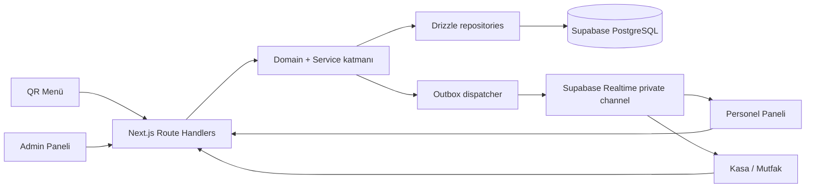

# Tarihi Şehir Lokantası — Phase 1–6 Development History

Bu belge, projenin mock veri prototipinden Supabase + Drizzle üzerinde çalışan
gerçek bir restoran backend'ine dönüşümünü kayıt altına alır. Kaynak, 14 Ağustos
2026 tarihli repository durumudur: `db/schema.ts`, `db/migrations/`, `app/api/`,
`lib/`, `components/`, `tests/` ve `docs/`.

> Dosya adı bağlantı kararlılığı için `phases-1-5-...` olarak bırakılmıştır;
> içerik Phase 6'yı da kapsar.

> ## ⚠️ Bu belge TARİHSELDİR
>
> Aşağıdaki her şey — 14 Ağustos 2026 repository durumu, `6c49056` HEAD'i,
> "Phase 7–15 NOT STARTED" satırı, dosya envanteri ve tüm durum anlık
> görüntüleri — **yazıldığı andaki** durumu anlatır. Hiçbiri bugünün durumu
> değildir ve bugünün beklentisi olarak okunmamalıdır. Belge, o dönüşümün
> kaydını korumak için olduğu gibi bırakılmıştır.
>
> ### Güncel durum — release candidate (`release/phase5-candidate`)
>
> | Aşama | Durum |
> | --- | --- |
> | Phase 1 | COMPLETE |
> | Phase 2 | COMPLETE |
> | Phase 3 | Veritabanı **aktive edildi** |
> | Phase 4 | Gerçek PostgreSQL servis E2E **tamamlandı** |
> | Phase 5A | Sahiplik (ownership) düzeltmesi **tamamlandı** |
> | Phase 5B | Reconciliation **tamamlandı** |
> | Phase 5C | Assembly / validation **devam ediyor** |
>
> **Deploy edilmemiştir.** Release candidate hiçbir production ortamına
> gönderilmemiştir; bu belgedeki hiçbir ifade bir deployment kanıtı değildir.

> **Faz sınırları hakkında dürüst uyarı.** Phase 1–4 geliştirmelerinin neredeyse
> tamamı ayrı commit'lere bölünmeden working tree üzerinde birikmiştir. `main`
> dalının son commit'i `6c49056` olup içeriği frontend prototip dönemine aittir.
> Bu nedenle faz ayrımı **commit geçmişinden kesin olarak türetilemez**. Aşağıda
> faz atamaları, kodun kendi içindeki isimlendirmeye (`phase3-*`, `phase4-*`
> testleri, `0003_phase3_...` migration'ı) ve `docs/security-foundation.md`
> içindeki faz başlıklarına dayanır. Bu kanıtların bulunmadığı yerde belirsizlik
> açıkça işaretlenmiştir.

---

## Genel Özet

| Faz | Konu | Durum |
| --- | --- | --- |
| Phase 1 | Veritabanı temeli, domain modeli, güvenlik primitifleri | COMPLETE |
| Phase 2 | Kimlik doğrulama, tenant scope, abuse kontrolleri | COMPLETE |
| Phase 3 | Müşteri ve personel operasyon API'leri, outbox, realtime | COMPLETE |
| Phase 4 | Canlı paneller, ödeme, admin CRUD, dead-letter | COMPLETE |
| Phase 5 | Masa kartı hızlı aksiyonlarının gerçek sisteme bağlanması | COMPLETE |
| Phase 6 | Servis anı operasyonları: ürün ekleme, iptal, masa taşı/birleştir/sıfırla | COMPLETE |
| Phase 7–15 | Repository'de canonical bir roadmap dokümanı yok | NOT STARTED *(bu belgenin yazıldığı tarihteki durum; sonraki fazlar için yukarıdaki güncel durum tablosuna bakın)* |

Phase 5 sonunda sistem; QR menüden sipariş alan, mutfak/garson/kasa panelleri
canlı çalışan, ödemesi tek transaction'da korunan, admin tarafı tamamen API'ye
bağlı, çok kiracılı (multi-tenant) bir restoran uygulamasıdır.

---

## Başlangıç Mimarisi

`main` üzerindeki son commit'e (`6c49056`) kadar proje bir **frontend
prototipiydi**:

- Veri kaynağı `lib/mock-data/` altındaki statik dizilerdi (`orders.ts`,
  `tables.ts`, `products.ts`, `categories.ts`, `calls.ts`, `reports.ts`,
  `staff.ts`).
- Panel ekranları bu dizileri doğrudan render ediyordu; hiçbir mutasyon kalıcı
  değildi.
- `lib/firebase/` altında bir Firebase kurulumu vardı; backend olarak
  kullanılmadı.
- Sipariş/çağrı/ödeme işlemleri yalnızca UI seviyesindeydi.

Prototip commit'leri:

| Commit | Açıklama |
| --- | --- |
| `7b571cd` | Initial frontend prototype with Firebase setup |
| `0d14d97` | Update admin identity to Sedat Cetinkaya |
| `35e1408` | Add localized QR menu and unique product imagery |
| `9306762` | QR menu language selector and localization updates |
| `69b66cb` | Döviz seçici ve canlı kur güncellemesi |
| `b917514` | Döviz popup görselleri ve canlı kur sistemi |
| `8485b32` | Menü motion ve sepet etkileşimleri |
| `6c49056` | Motion sisteminin iyileştirilmesi (bu belge yazıldığında `main` HEAD'i; artık değil) |

Phase 1 ile başlayan backend çalışmalarının tamamı bu commit'in üzerinde,
commit edilmemiş halde durmaktadır.

---

## Phase 1 — Veritabanı temeli ve domain çekirdeği

### Amaç

Mock dizilere dayanan prototipe, çok kiracılı ve para/durum güvenliği olan
gerçek bir veri modeli kazandırmak.

### Phase Öncesi Durum

Kalıcı veri yok; tüm state bellek içinde ve tarayıcıda.

### Yapılan Değişiklikler

- PostgreSQL/Supabase şeması Drizzle ile tanımlandı (`db/schema.ts`).
- 17 tablo, 13 enum tipi, restoran-kapsamlı unique/index/check kısıtları.
- Saf domain katmanı kuruldu: durum makineleri, para aritmetiği, idempotency
  parmak izi, tenant scope kararı.
- QR token üretimi ve HMAC doğrulaması.

### Database

`0000_central_restaurant_foundation.sql` (737 satır):

- Tablolar: `restaurants`, `staff_profiles`, `categories`, `products`,
  `restaurant_tables`, `restaurant_counters`, `orders`, `order_items`,
  `kitchen_tickets`, `waiter_calls`, `order_events`, `payments`,
  `restaurant_settings`, `audit_logs`, `outbox_events`, `idempotency_keys`.
- Tüm domain tablolarında RLS açılır, browser rollerinden doğrudan mutation
  yetkileri geri alınır.
- `staff_profiles.auth_user_id -> auth.users.id` FK'si kurulur.
- Kritik kısıtlar bu fazda konur ve sonraki fazlar bunlara yaslanır:
  `orders_total_formula_check`, `orders_creator_check`,
  `waiter_calls_one_active_type_per_table_key` (kısmi unique index),
  `restaurant_tables_qr_hash_format_check`.

### Backend

| Dosya | Sorumluluk |
| --- | --- |
| `lib/domain/status.ts` | Sipariş/kalem/çağrı/ödeme/masa durumları ve geçiş matrisleri |
| `lib/domain/money.ts` | Minor-unit para aritmetiği; float kullanılmaz |
| `lib/domain/restaurant-scope.ts` | Fail-closed tenant erişim kararı |
| `lib/domain/idempotency.ts` | Deterministik istek parmak izi |
| `lib/security/qr-token.ts(.server)` | 32 byte token üretimi, `v1.<HMAC>` saklama |
| `lib/security/redaction.ts`, `logger.ts` | Sır maskeleyen yapılandırılmış log |
| `lib/env/` | Lazy, capability-scoped ortam doğrulaması |

### Security

- Rol geçişleri kenar-tabanlı (`canRoleTransitionOrderStatus`): kasa yalnız
  `SERVED → COMPLETED`, mutfak yalnız hazırlık aşamaları.
- QR token'ın kendisi asla veritabanına yazılmaz veya loglanmaz; sabit zamanlı
  karşılaştırma ile doğrulanır.
- Para değerleri exact decimal string olarak taşınır.

### Tests

`money.test.ts`, `money-rate.test.ts`, `status-transition.test.ts`,
`restaurant-scope.test.ts`, `idempotency.test.ts`, `qr-token.test.mjs`,
`redaction.test.mjs`, `env.test.mjs`, `migration-security.test.ts`.

### Kaldırılan Mock / Demo Davranışlar

Bu fazda henüz UI'dan mock kaldırılmadı; temel hazırlandı.

### Teknik Kararlar

- ORM olarak Drizzle: migration SQL'i review edilebilir kalsın diye.
- Domain katmanı framework'ten bağımsız saf TypeScript; hem sunucu hem panel
  aynı kuralı okuyabilsin diye.

### Phase Sonu Durumu

Şema ve domain kuralları hazır; henüz HTTP yüzeyi yok.

---

## Phase 2 — Kimlik, tenant izolasyonu ve abuse kontrolleri

> Phase 1 ve Phase 2 arasındaki sınır commit geçmişinden kesin olarak
> ayrılamamaktadır; aşağıdaki çalışma seti bu iki faz arasındaki geçiş
> döneminde yer almaktadır.

### Amaç

Personel kimliğini Supabase Auth'a bağlamak, her isteği bir restorana
kilitlemek ve kötüye kullanımı sınırlamak.

### Backend

- `lib/auth/foundation/` — Supabase auth kullanıcısından aktif
  `staff_profiles` kaydına çözümleme (`resolveStaffPrincipal`).
- `lib/auth/current-staff.ts` — istek başına memoize edilen kimlik;
  `requireCurrentStaffPrincipal()` legacy HMAC oturumlarını tenant API'leri
  için **bilerek reddeder**.
- `lib/auth/provider-selection.ts` — Supabase public config varsa Supabase,
  yoksa legacy HMAC; tek uyumluluk sınırı.
- `lib/auth/role-access.ts` — panel bazlı erişim ve rol ana sayfaları.
- `lib/security/rate-limit*.ts` — merkezi `api_rate_limits` tablosu üzerinde
  atomik paylaşımlı sayaç; anahtarlar HMAC'lenir.
- `lib/security/origin.ts` — cookie ile kimlik doğrulanan her mutasyonda
  same-origin/CSRF kontrolü.

### Database

| Migration | Amaç |
| --- | --- |
| `0001_strange_radioactive_man.sql` | `api_rate_limits` tablosu + RLS |
| `0002_lovely_ultron.sql` | `staff_profiles.login_identifier` + kısmi unique index + format check |
| `0004_far_colossus.sql` | Rate-limit satırlarının `request_count` ile konsolidasyonu, `key_hash` unique |

> `0001`, `0002` ve `0004` numaralı migration'ların hangi faza ait olduğu
> repository'den kesin belirlenememektedir; içerikleri kimlik ve abuse kontrolü
> konularına aittir ve bu bölümde toplanmıştır.

### Security

| Aksiyon | Politika |
| --- | --- |
| Personel girişi | 15 dakikada 5 deneme (IP ve IP+identifier) |
| QR doğrulama | Dakikada 30 (IP) |
| Sipariş oluşturma | Dakikada 5 (masa oturumu) + zorunlu idempotency |
| Garson çağrısı | Masa/tip başına 1 açık çağrı + 30 sn bekleme |
| Hesap talebi | Masa başına 1 açık talep + 2 dk bekleme |

### Tests

`auth-foundation.test.ts`, `rate-limit.test.ts`,
`phase3-rate-limit-config/-migration/-response/-window.test.ts`,
`customer-session.test.mjs`, `api-contract.test.ts`,
`request-validation.test.ts`.

### Phase Sonu Durumu

Her istek bir principal ve bir restorana bağlanabiliyor; sınır ihlalleri
fail-closed.

---

## Phase 3 — Operasyon API'leri, outbox ve realtime

### Amaç

Müşteri ve personel akışlarını gerçek HTTP uçlarına taşımak; panelleri canlı
tutmak.

### Phase Öncesi Durum

Domain ve kimlik hazır; paneller hâlâ mock veriyle çalışıyor.

### API

| Route | Method | Kullanan | Amaç |
| --- | --- | --- | --- |
| `/api/table-sessions` | POST | Müşteri | QR token doğrulama, masa oturumu cookie'si |
| `/api/menu` | GET | Müşteri | Masa oturumuna kapsamlı menü |
| `/api/orders` | POST | Müşteri | Idempotent sipariş oluşturma |
| `/api/orders/active` | GET | Müşteri | Masanın aktif siparişleri |
| `/api/calls` | POST | Müşteri | Garson çağrısı |
| `/api/bill-requests` | POST | Müşteri | Hesap talebi |
| `/api/orders/[orderId]/status` | PATCH | Personel | Sipariş durum geçişi |
| `/api/order-items/[orderItemId]/status` | PATCH | Personel | Kalem durum geçişi |
| `/api/staff/orders` | GET | Personel | Sipariş listesi (durum/masa/tarih filtresi) |
| `/api/staff/calls` | GET | Personel | Servis istekleri |
| `/api/staff/calls/[callId]` | PATCH | Personel | Üstlen / tamamla |
| `/api/staff/tables` | GET | Personel | Salon durumu + aktif sipariş + açık çağrı sayısı |
| `/api/staff/login`, `/api/staff/logout` | POST | Personel | Oturum |
| `/api/internal/outbox/dispatch` | POST | Scheduler | Outbox worker tetikleyicisi |

### Backend

- `lib/services/order-service.ts` — sipariş oluşturma tek transaction:
  idempotency claim → masa/ürün kilidi → fiyat/servis/vergi hesabı → sipariş,
  kalemler, order event, outbox event → idempotency completion.
- `lib/services/waiter-call-service.ts` — müşteri çağrısı; aktif çağrı varsa
  yenisini açmaz, cooldown uygular.
- `lib/services/staff-order-service.ts`, `staff-call-service.ts`,
  `staff-table-service.ts` — personel okuma/mutasyon yüzeyleri.
- `lib/services/outbox-dispatcher.ts` — `FOR UPDATE SKIP LOCKED` ile satır
  claim, alan izinli (allowlisted) envelope, Supabase REST broadcast ACK'inden
  sonra `PUBLISHED`, başarısızlıkta bounded exponential backoff.
- `lib/realtime/use-staff-realtime.ts` — panel başına tek private kanal
  aboneliği; `eventId` ile de-duplication ve her olayda REST'ten yeniden okuma.

### Frontend

Personel panelleri mock veriden API'ye geçti: `components/staff/orders-list.tsx`,
`waiter-calls-list.tsx`, `use-staff-floor.ts`, `staff-floor.tsx`,
`realtime-status.tsx`, `components/kitchen/kitchen-board.tsx`,
`components/menu/menu-experience.tsx`. Veri erişimi için kütüphane eklenmedi;
`lib/hooks/use-api-resource.ts` (abort + focus revalidation + polling) canonical
çözüm olarak yazıldı.

### Database

| Migration | Amaç |
| --- | --- |
| `0003_phase3_supabase_permissions.sql` | Realtime/Storage şemalarına korumalı (guarded) politika eklemeleri |
| `0005_pale_violations.sql` | `order_event_type` enum'una `ORDER_ITEM_STATUS_CHANGED` değeri |

### State / Data Flow

`useApiResource` tek server-state çözümüdür. Realtime olayı yalnızca bir
"değişiklik sinyali"dir; panel her olayda REST API'yi yeniden okur, böylece API
tek doğruluk kaynağı kalır.

### Security

- Sipariş/çağrı/hesap uçları restoran ve masa kimliğini **istek gövdesinden
  değil**, imzalı masa oturumu cookie'sinden türetir.
- Müşteriye Realtime kanalı verilmez; menü ve aktif sipariş görünümü focus /
  visibility / kısa aralıklı revalidation ile tazelenir.
- Outbox teslimatı at-least-once; istemciler `eventId` ile tekrar eden olayı
  eler.

### Tests

`phase3-auth`, `phase3-customer-orders`, `phase3-customer-waiter-call`,
`phase3-origin`, `phase3-outbox-dispatch-auth`, `phase3-outbox-dispatcher`,
`phase3-outbox-runtime-budget`, `phase3-realtime-event`, `phase3-staff-calls`,
`phase3-staff-orders`, `phase3-supabase-cookie-policy`,
`phase3-supabase-permissions` (foundation) ve `phase3-backend-flow`,
`phase3-http-e2e`, `phase3-supabase-rls` (integration).

### Kaldırılan Mock / Demo Davranışlar

Sipariş listesi, çağrı listesi, mutfak panosu ve QR menü artık gerçek API
okur. `lib/services/restaurant-service.ts` (mock servis) silindi.

### Phase Sonu Durumu

Müşteri → sipariş → mutfak → garson akışı uçtan uca gerçek.

---

## Phase 4 — Canlı paneller, ödeme ve admin CRUD

### Amaç

Admin panelini gerçek veriye bağlamak, parayı güvenceye almak ve outbox'ı
operasyonel olarak yönetilebilir kılmak.

### API

| Route | Method | Amaç |
| --- | --- | --- |
| `/api/admin/menu` | GET | Kategori + ürün listesi |
| `/api/admin/categories` | POST | Kategori oluşturma |
| `/api/admin/categories/[categoryId]` | PATCH | Kategori güncelleme |
| `/api/admin/products` | POST | Ürün oluşturma |
| `/api/admin/products/[productId]` | PATCH | Ürün güncelleme |
| `/api/admin/products/[productId]/image` | POST | Görsel yükleme (sunucu üretimli yol) |
| `/api/admin/tables` | POST | Masa + QR oluşturma (ham token bir kez döner) |
| `/api/admin/tables/[tableId]` | PATCH | Masa güncelleme |
| `/api/admin/tables/[tableId]/qr/rotate` | POST | QR rotasyonu |
| `/api/admin/tables/[tableId]/qr/revoke` | POST | QR iptali |
| `/api/admin/settings` | GET, PATCH | Restoran ayarları |
| `/api/admin/staff` | GET, POST | Personel listesi/oluşturma |
| `/api/admin/staff/[staffId]` | PATCH | Personel güncelleme |
| `/api/admin/reports` | GET | Rapor verisi |
| `/api/admin/outbox/retry` | POST | Dead-letter olayları manuel requeue |
| `/api/payments` | POST | Ödeme tahsilatı |

### Backend

- `lib/api/admin-route.ts` — paylaşılan `ADMIN`/`MANAGER` route zarfı: güvenilir
  origin, yeniden yetkilendirilmiş principal, restoran-kapsamlı repository,
  audit kaydı, outbox olayı.
- `lib/services/payment-service.ts` — sipariş satırı kilitlenir, **tutar
  veritabanından okunur**, tek ödeme satırı yazılır, sipariş kapatılır,
  event/audit eklenir.
- `lib/services/admin-*-service.ts` — menü, ayarlar, personel, raporlar.
- `lib/services/outbox-dispatcher.ts` — retry bütçesi tükenen olaylar
  `dead_lettered_at` ile işaretlenir; artık claim edilmez.

### Frontend

`components/admin/use-admin-menu.ts`, `use-admin-tables.ts`,
`use-admin-reports.ts` hook'ları ve tüm admin yöneticileri
(`categories-manager`, `products-manager`, `tables-manager`, `qr-manager`,
`settings-manager`, `staff-manager`, `orders-manager`, `reports-view`,
`dashboard-view`, `menu-overview`, `admin-charts`) gerçek API'ye bağlandı.

### Database

| Migration | Amaç |
| --- | --- |
| `0006_clean_wiccan.sql` | `payments_one_active_per_order_key`: `PENDING`/`COMPLETED` ödeme için sipariş başına tek satır |
| `0007_medical_senator_kelly.sql` | `outbox_events.dead_lettered_at` + kısmi index |

### Security

- **Çift tahsilat koruması**: kısmi unique index son savunma;
  `Idempotency-Key` başlığı orijinal makbuzu tekrar oynatır.
- İstemciden gelen tutara asla güvenilmez.
- Personel hesabı oluşturmada önce Supabase auth kullanıcısı açılır, profil
  insert'i başarısız olursa geri silinir — yarım kalmış login bırakılmaz.
- Ürün görselleri sunucu üretimli, restoran-kapsamlı yola yazılır; veritabanı
  yazımı başarısız olursa nesne silinir.

### Tests

`phase4-admin-menu`, `phase4-payments`, `phase4-view-models` (foundation),
`phase4-admin-e2e` (integration).

### Phase Sonu Durumu

Admin, kasa, mutfak ve garson panelleri gerçek veriyle çalışıyor. Geriye kalan
tek demo yüzey, masa kartındaki altı hızlı aksiyondu.

---

## Phase 5 — Masa kartı hızlı aksiyonları

### Amaç

`components/staff/table-grid.tsx` içindeki altı hızlı aksiyon `toast.info` ile
sahte davranıyordu ("Bu işlem siparişler ve çağrılar ekranlarından tamamlanır").
Bunları gerçek backend'e bağlamak ve masa kartını operasyon merkezi hâline
getirmek.

### Phase Öncesi Durum

```ts
function runDemoAction(action: string) {
  toast.info(`${selectedTable.name}: ${action}`, {
    description: "Bu işlem siparişler ve çağrılar ekranlarından tamamlanır.",
  });
}
```

Altı buton da bu fonksiyonu çağırıyordu; hiçbiri veritabanına yazmıyordu.

### Altı Aksiyonun Dönüşümü

| Quick Action | Phase 5 Öncesi | Phase 5 Sonrası | Backend Kaynağı |
| --- | --- | --- | --- |
| Sipariş Ekle | `toast.info` | Menüden ürün seçtiren sipariş pad'i; gerçek sipariş açar | `POST /api/staff/orders` + `GET /api/staff/menu` → `OrderService.createStaffOrder` |
| Siparişi Onayla | `toast.info` | Aktif siparişi `NEW → CONFIRMED` yapar | `PATCH /api/orders/[orderId]/status` → `OrderService.updateStatus` |
| Servis Edildi | `toast.info` | Aktif siparişi `READY → SERVED` yapar | `PATCH /api/orders/[orderId]/status` → `OrderService.updateStatus` |
| Garson Talebi | `toast.info` | Açık çağrı varsa tamamlar, yoksa yeni çağrı açar | `PATCH /api/staff/calls/[callId]` veya `POST /api/staff/calls` |
| Hesap | `toast.info` | Açık hesap talebi varsa tamamlar, yoksa açar | `PATCH /api/staff/calls/[callId]` veya `POST /api/staff/calls` |
| Masa Notu | `toast.info` | Açık not varsa kapatır, yoksa metin alıp not kaydeder | `POST /api/staff/calls` (`type: OTHER`, `requestLabel: "Masa notu"`) |

Buton isimleri korunmuştur; aksiyonun o an ne yapacağı `aria-label` ve
tooltip ile bildirilir.

### Backend

Yeni uçlar:

| Route | Method | Amaç |
| --- | --- | --- |
| `/api/staff/calls` | POST | Personel tarafından servis isteği/not açma |
| `/api/staff/orders` | POST | Garsonun masada sipariş alması (`Idempotency-Key` zorunlu) |
| `/api/staff/menu` | GET | Sipariş pad'i için personel kapsamlı katalog |

Yeni servis yetenekleri:

- `StaffCallService.createCall()` — masa satırı kilitlenir, aktif çağrı varsa
  **oluşturmadan** o kayıt döner (`created: false`, HTTP 200), yoksa insert
  edilir; insert yarışı kaybedilirse kazanan satır okunur. Outbox ve audit
  yalnızca gerçekten oluşturulan satır için yazılır.
- `OrderService.createStaffOrder()` — misafir siparişiyle **aynı** transaction,
  fiyatlama ve idempotency yolunu paylaşır. Ayrıştırılan tek şey `OrderCreator`
  tipidir: müşteri için token sürümü + `orderingEnabled` kontrolü, personel için
  bunların ikisi de atlanır (garsonun QR oturumu yoktur ve self-servis anahtarı
  garsonu bağlamaz). Satır `created_by_type = 'STAFF'` ve aktif profil id'si ile
  yazılır, ayrıca audit kaydı düşer.

### Frontend

| Dosya | Değişiklik |
| --- | --- |
| `components/staff/table-grid.tsx` | `runDemoAction` kaldırıldı; altı aksiyon gerçek mutasyona bağlandı, pending/disabled/hata durumları eklendi |
| `components/staff/table-order-composer.tsx` | Yeni: garson sipariş pad'i (arama, adet, not, tahmini ara toplam) |
| `components/staff/use-staff-floor.ts` | `calls` ve `refetch` dışa açıldı; `openCallCount` artık yalnız `WAITER_CALL` sayar |
| `components/staff/staff-floor.tsx` | Yeni prop'ları iletir |
| `lib/adapters/staff-view-model.ts`, `types/index.ts` | `Masa notu` etiketi çağrı listesinde korunur |

### Database

**Yeni migration yok.** Şema her iki yeteneği de zaten taşıyordu:

- `order_creator_type` enum'u `'STAFF'` değerini Phase 1'den beri içeriyor ve
  `orders_creator_check` kısıtı `STAFF` siparişinde `created_by_user_id`
  zorunlu kılıyordu.
- `waiter_calls_one_active_type_per_table_key` kısmi unique index'i
  `(restaurant_id, table_id, type)` üçlüsü için aktif satırda tekilliği zaten
  garanti ediyordu.

Kullanılan tablolar: `restaurant_tables`, `orders`, `order_items`,
`waiter_calls`, `order_events`, `outbox_events`, `audit_logs`,
`idempotency_keys`, `products`, `restaurant_settings`.

### State / Data Flow

```
Buton
 → lib/domain/table-actions.ts (hangi aksiyon açık, hangi intent)
 → staffApi.* (lib/api/endpoints.ts)
 → route: origin + auth + zod doğrulama
 → service: yeniden yetkilendirme + transaction
 → DB + order_events + outbox_events + audit_logs
 → floor.refetch() (REST tekrar okunur)
 → toast (yalnız gerçek 2xx sonrası)
```

Aktif sipariş, istemcide `orders[0]` ile tahmin edilmez: sunucu
`/api/staff/tables` içinde açık siparişleri window fonksiyonu ile sıralayıp
`activeOrder`'ı belirler; masa kartı bu id ile eşleşen siparişi kullanır.

### Security

- Rol politikası `lib/domain/table-actions.ts` içinde tek yerde; panel bunu
  yalnızca **görünürlük** için kullanır, sunucu her kuralı yeniden türetir.
- Sipariş açma: `ADMIN`, `MANAGER`, `WAITER`. Servis isteği: bunlara ek
  `CASHIER` (yalnız `BILL_REQUEST`). `KITCHEN` hiçbirine erişemez.
- `tableId` dışında hiçbir domain değeri istemciden alınmaz; restoran kimliği
  oturumdan gelir, bu nedenle başka kiracının masası 404 verir.
- Her iki yeni mutasyon ucu da `assertTrustedMutationOrigin` ile korunur
  (yabancı `Origin` → 403, kimliksiz istek → 401; dev sunucusunda doğrulandı).
- Ödeme akışı bu fazda **hiç** dokunulmadı: masa kapatma/ödeme işaretleme
  aksiyonu bilinçli olarak eklenmedi.

### Tests

| Test | Tip | Ne doğruluyor |
| --- | --- | --- |
| `phase5-table-actions.test.ts` | unit | 12 test: aksiyon politikası, rol matrisi, durum bağımlı açık/kapalı, intent seçimi |
| `phase5-table-actions-api.test.ts` | foundation | 11 test: çağrı oluşturma transaction'ı, idempotent tekrar, insert yarışı, not semantiği, rol/tenant reddi |
| `phase5-staff-orders.test.ts` | foundation | 12 test: DB fiyatlaması, STAFF atıfı, idempotency replay/conflict, rol reddi, tenant izolasyonu |
| `phase5-staff-table-actions-e2e.integration.test.ts` | E2E (opt-in) | Masa Grid ↔ Orders ↔ Calls tutarlılığı, replay, cross-tenant ve rol reddi |

### Kaldırılan Mock / Demo Davranışlar

`runDemoAction` ve altı butonun `toast.info` çağrısı tamamen kaldırıldı.
Kod tabanında masa kartına ait başka demo yol kalmadı.

### Teknik Kararlar

- **Not için ikinci tablo açılmadı.** `waiter_calls` zaten masa-kapsamlı istek
  tablosuydu; `OTHER` tipi ve `request_label` alanı bu iş için mevcuttu. Tekillik
  garantisi de kısmi unique index'ten bedava geldi.
- **Not bir servis çağrısı değildir**: masa durumunu değiştirmez ve panoda açık
  garson çağrısı olarak sayılmaz.
- **Sipariş oluşturma kopyalanmadı.** `OrderService.createOrder` özel bir
  `create()` gövdesine indirildi ve iki giriş noktası (müşteri/personel) bunu
  paylaşır; böylece fiyatlama ve idempotency tek yerde kaldı.
- **Yeni bir state kütüphanesi eklenmedi**; mevcut `useApiResource` ve
  `refetch` kullanıldı.

### Phase Sonu Durumu

Masa kartı, siparişler ekranı, çağrılar ekranı, admin ve veritabanı aynı
durumu gösterir. Garson artık ekran değiştirmeden masa üzerinden çalışabilir.

---

## Phase 6 — Servis anı operasyonları

### Amaç

Phase 5 sonunda garson siparişi *başlatabiliyor* ama servis sırasında değişen
hiçbir şeyi yönetemiyordu. Phase 6, gerçek serviste kaçınılmaz olan düzeltmeleri
ekler: sonradan ürün ekleme, kalem/sipariş iptali, masa taşıma, masa birleştirme
ve güvenli masa sıfırlama.

### Phase Öncesi Durum

- Her ek istek yeni ve bağımsız bir sipariş açmayı gerektiriyordu.
- Sipariş kalemi iptali yoktu; `canRoleTransitionOrderItemStatus` `CANCELLED`
  hedefini bilinçli olarak reddediyordu.
- Masa taşıma/birleştirme/sıfırlama hiç yoktu (Phase 5 raporunda açıkça
  sınırlama olarak belirtilmişti).
- Sipariş toplamları yalnızca oluşturma anında hesaplanıyordu.

### Yapılan Değişiklikler

| Operasyon | Endpoint | Kural |
| --- | --- | --- |
| Mevcut siparişe ürün ekleme | `POST /api/orders/[orderId]/items` | Yalnız `NEW`/`CONFIRMED`/`PREPARING`; `Idempotency-Key` zorunlu |
| Kalem iptali | `POST /api/orders/[orderId]/items/[orderItemId]/cancel` | Soft cancel; aşamaya göre rol |
| Sipariş iptali | `POST /api/orders/[orderId]/cancel` | MANAGER/ADMIN; `SERVED` ve sonrası reddedilir |
| Masa taşıma | `POST /api/staff/tables/[tableId]/transfer` | Hedef boş olmalı |
| Masa birleştirme | `POST /api/staff/tables/merge` | MANAGER/ADMIN; hedef dolu olabilir |
| Masa sıfırlama | `POST /api/staff/tables/[tableId]/reset` | MANAGER/ADMIN; her açık kayıt engeller |

### Backend

- `lib/domain/order-mutations.ts` — hangi statüde ürün eklenebilir, hangi rol
  hangi aşamadaki kalemi iptal edebilir, ve `calculateOrderAmounts` (tek para
  hesabı kaynağı).
- `lib/domain/table-operations.ts` — masa operasyonu rolleri, reset engelleyici
  politikası ve `deriveTableStatus` (masa durumu türetimi).
- `OrderService.addItems / cancelItem / cancelOrder` — hepsi tek transaction,
  satır kilidi ve `version` guard'ı ile.
- `TableOperationsService` + `DrizzleTableOperationsRepository` — iki masayı tek
  `id` sıralı ifadede kilitler; kısmi taşımayı reddeder.

### Frontend

| Dosya | Değişiklik |
| --- | --- |
| `components/staff/table-order-composer.tsx` | `appendToOrderId` modu: aynı pad hem yeni sipariş hem ekleme yapar |
| `components/staff/table-grid.tsx` | Kalem iptali, sipariş iptali, operasyon paneli |
| `components/staff/cancellation-reason-form.tsx` | Yeni: ortak iptal nedeni seçici |
| `components/staff/table-operations-panel.tsx` | Yeni: "Diğer işlemler" (taşı/birleştir/sıfırla) |
| `components/kitchen/kitchen-board.tsx` | İptal edilen kalem soluk + üstü çizili; sonradan eklenen kalem "Yeni eklendi" rozeti |
| `lib/services/admin-reports-service.ts` | İptal edilen kalemler artık çok satanlara girmiyor |

### Database

`0008_short_living_lightning.sql` (additive):

- `order_event_type` enum'una `ORDER_ITEMS_ADDED` ve `ORDER_ITEM_CANCELLED`.
- `orders.service_fee_rate` ve `orders.tax_rate` (nullable) — siparişin
  açıldığı andaki oranlar. Sonradan yapılan ayar değişikliği çalışan siparişi
  yeniden fiyatlamasın diye.

`order_items.status = CANCELLED` ve `cancelled_at` Phase 1'den beri şemada
olduğu için iptal için ek kolon gerekmedi.

### Security

- Fiyat, tutar, masa durumu ve restoran kimliği istemciden hiç alınmaz.
- Ödemesi alınmış sipariş `ORDER_ALREADY_COMPLETED` ile korunur; reset ve iptal
  ödeme akışını bypass edemez.
- Masa taşıma müşteri oturumunu **taşımaz**; eski oturum yeni masaya yetki
  kazanmaz.
- Her iki yeni mutasyon grubu da `assertTrustedMutationOrigin` ile korunur.

### Tests

`phase6-order-add-items` (16), `phase6-item-cancel` (14), `phase6-order-cancel`
(10), `phase6-table-transfer` (13), `phase6-table-merge` (11),
`phase6-table-reset` (11) — toplam 75 foundation testi. Ayrıca
`phase6-order-and-table-operations-e2e` (opt-in integration).

### Teknik Kararlar

- **`READY`/`SERVED` siparişe ürün eklenmez.** Durumu sessizce geri sarmak
  yerine yeni bir sipariş açılır; masa zaten birden fazla siparişi taşıyabiliyor.
- **Kalem silinmez.** İptal geçmişi finansal denetim için korunur.
- **İptal nedeni için yeni kolon açılmadı**; audit metadata yeterli.
- **Oranlar siparişe yazıldı**; aksi hâlde ayar değişikliği eski siparişi
  yeniden fiyatlardı.
- **Birleştirmede sipariş kimlikleri korunur**; iki sipariş tek satıra
  ezilmez, bu ileride hesap bölme için de güvenli zemin bırakır.

### Phase Sonu Durumu

Garson servis boyunca masayı yönetebiliyor; mutfak, kasa, admin ve veritabanı
aynı gerçeği görüyor. Ödeme hâlâ tek normal kapanış yolu.

---

## Phase 1–5 Sonunda Sistem Mimarisi



### Domain modeli

```
Restaurant
├── RestaurantSettings
├── StaffProfile            (Supabase auth kullanıcısına bağlı)
├── Category
│   └── Product
├── RestaurantTable         (QR token hash + sürüm + iptal damgası)
│   ├── Order               (aktif sipariş sunucuda sıralanır)
│   │   ├── OrderItem
│   │   ├── OrderEvent
│   │   └── Payment
│   └── WaiterCall          (WAITER_CALL | BILL_REQUEST | OTHER)
├── AuditLog
├── OutboxEvent             (dead_lettered_at ile sonlandırılabilir)
├── IdempotencyKey
└── ApiRateLimit
```

| Entity | Açıklama |
| --- | --- |
| `restaurants` | Kiracı kökü; her sorgu bu id ile kapsanır |
| `restaurant_settings` | Sipariş/çağrı/hesap anahtarları, servis ve vergi oranları |
| `staff_profiles` | Rol, aktiflik, `auth_user_id`, `login_identifier` |
| `restaurant_tables` | Masa + QR kimliği; ham token asla saklanmaz |
| `orders` / `order_items` | Fiyat snapshot'lı sipariş; toplam formülü DB kısıtı |
| `waiter_calls` | Masa-kapsamlı servis isteği ve masa notu |
| `payments` | Sipariş başına tek aktif ödeme (kısmi unique index) |
| `order_events` / `audit_logs` | Domain olay ve denetim izi |
| `outbox_events` | Realtime yayını için transactional outbox |
| `idempotency_keys` | Tekrar oynatılabilir mutasyon sonuçları |
| `api_rate_limits` | Paylaşımlı atomik sabit-pencere sayacı |

---

## Database / Migration Geçmişi

| Migration | Faz | Amaç | Önemli değişiklik |
| --- | --- | --- | --- |
| `0000_central_restaurant_foundation` | 1 | Şema temeli | 17 tablo, 13 enum, RLS, `auth.users` FK'si, aktif çağrı unique index'i |
| `0001_strange_radioactive_man` | 1–2 geçişi | Abuse kontrolü | `api_rate_limits` tablosu + RLS |
| `0002_lovely_ultron` | 1–2 geçişi | Personel girişi | `login_identifier` + kısmi unique + format check |
| `0003_phase3_supabase_permissions` | 3 | Realtime/Storage | Korumalı politika eklemeleri (düz PostgreSQL'de no-op) |
| `0004_far_colossus` | 2–3 geçişi | Rate limit | `request_count` konsolidasyonu, `key_hash` unique |
| `0005_pale_violations` | 3 | Olay sözlüğü | `ORDER_ITEM_STATUS_CHANGED` enum değeri |
| `0006_clean_wiccan` | 4 | Ödeme güvenliği | Sipariş başına tek aktif ödeme |
| `0007_medical_senator_kelly` | 4 | Outbox | `dead_lettered_at` + kısmi index |
| — | 5 | — | **Migration gerekmedi** |
| `0008_short_living_lightning` | 6 | Sipariş düzeltmeleri | 2 order-event enum değeri + `orders.service_fee_rate` / `tax_rate` (nullable, additive) |

---

## API Geçmişi

| Route | Method | Kim kullanıyor | Amaç | İlk eklendiği faz |
| --- | --- | --- | --- | --- |
| `/api/table-sessions` | POST | Müşteri | Masa oturumu | 3 |
| `/api/menu` | GET | Müşteri | Menü | 3 |
| `/api/orders` | POST | Müşteri | Sipariş | 3 |
| `/api/orders/active` | GET | Müşteri | Aktif sipariş | 3 |
| `/api/calls` | POST | Müşteri | Garson çağrısı | 3 |
| `/api/bill-requests` | POST | Müşteri | Hesap talebi | 3 |
| `/api/orders/[orderId]/status` | PATCH | Personel | Sipariş durumu | 3 |
| `/api/order-items/[orderItemId]/status` | PATCH | Personel | Kalem durumu | 3 |
| `/api/staff/login` \| `/logout` | POST | Personel | Oturum | 2–3 |
| `/api/staff/orders` | GET | Personel | Sipariş listesi | 3 |
| `/api/staff/orders` | POST | Personel | **Masada sipariş alma** | 5 |
| `/api/staff/calls` | GET | Personel | Servis istekleri | 3 |
| `/api/staff/calls` | POST | Personel | **Servis isteği/not açma** | 5 |
| `/api/staff/calls/[callId]` | PATCH | Personel | Üstlen/tamamla | 3 |
| `/api/staff/tables` | GET | Personel | Salon durumu | 3 |
| `/api/staff/menu` | GET | Personel | **Sipariş pad'i kataloğu** | 5 |
| `/api/internal/outbox/dispatch` | POST | Scheduler | Outbox worker | 3 |
| `/api/payments` | POST | Kasa | Ödeme | 4 |
| `/api/admin/*` | GET/POST/PATCH | Admin | Menü, masa, QR, ayar, personel, rapor | 4 |
| `/api/admin/outbox/retry` | POST | Admin | Dead-letter requeue | 4 |
| `/api/exchange-rates` | GET | Müşteri | Döviz kuru | Prototip |

---

## Frontend Entegrasyon Geçmişi

| Yüzey | Prototip | Phase 3 | Phase 4 | Phase 5 |
| --- | --- | --- | --- | --- |
| QR menü | mock katalog | `/api/menu` + `/api/orders` | fiyat/stok anında yansır | — |
| Mutfak panosu | mock | `/api/staff/orders` + realtime | — | — |
| Çağrılar ekranı | mock | `/api/staff/calls` | — | masa kartıyla ortak state |
| Siparişler ekranı | mock | `/api/staff/orders` | — | masa kartıyla ortak state |
| Salon / masa grid | mock | `/api/staff/tables` | — | **altı aksiyon gerçek** |
| Kasa | mock | — | `/api/payments` | — |
| Admin | mock | — | tüm CRUD API'ye bağlandı | — |

---

## Security Geçmişi

| Konu | Nerede kuruldu | Bugünkü durum |
| --- | --- | --- |
| Kimlik doğrulama | Phase 2 | Supabase Auth otoriter; legacy HMAC yalnız tek uyumluluk sınırında |
| Yetkilendirme | Phase 1–2 | Kenar-tabanlı rol geçişleri + `authorizeRestaurantAccess` fail-closed |
| Tenant izolasyonu | Phase 1–2 | Her sorgu `restaurant_id` kapsamlı; RLS ikinci sınır |
| Girdi doğrulama | Phase 2–3 | Her route'ta zod; `.strict()` ile mass assignment kapalı |
| CSRF | Phase 2 | Cookie ile kimlik doğrulanan tüm mutasyonlarda origin kontrolü |
| Transaction | Phase 3 | Sipariş, çağrı, durum geçişi, ödeme tek transaction |
| Satır kilidi | Phase 3–4 | `FOR UPDATE` ile sipariş/masa/çağrı satırları |
| Idempotency | Phase 3 | `idempotency_keys` + istek parmak izi; Phase 4 ödemeye, Phase 5 personel siparişine genişletildi |
| Ödeme otoritesi | Phase 4 | Tutar yalnız DB'den; kısmi unique index çift tahsilatı keser |
| Outbox / dead-letter | Phase 3–4 | At-least-once teslimat, bounded backoff, `dead_lettered_at`, manuel requeue |
| Rate limiting | Phase 2 | Merkezi atomik sayaç, HMAC'li anahtarlar, `429 + Retry-After` |
| Audit | Phase 1–4 | Append-only `audit_logs`; Phase 5 çağrı ve personel siparişini de yazar |
| Log güvenliği | Phase 1 | Token/cookie/PIN/secret maskeleyen yapılandırılmış logger |

---

## Test Geçmişi

| Faz | Test | Tip | Ne doğruluyor |
| --- | --- | --- | --- |
| 1 | `money`, `money-rate` | unit | Minor-unit para aritmetiği, oran uygulaması |
| 1 | `status-transition` | unit | Durum makinesi ve rol bazlı geçiş izinleri |
| 1 | `restaurant-scope` | unit | Fail-closed tenant kararı |
| 1 | `qr-token`, `redaction`, `env` | unit | Token HMAC'i, log maskesi, ortam doğrulaması |
| 1 | `migration-security` | foundation | Migration'ların güvenlik varsayımları |
| 1–2 | `idempotency`, `api-contract`, `request-validation` | foundation | Parmak izi, API zarfı, girdi doğrulama |
| 2 | `auth-foundation`, `customer-session` | foundation | Principal çözümleme, imzalı masa cookie'si |
| 2 | `rate-limit`, `phase3-rate-limit-*` | foundation | Politika, pencere, migration, `429` yanıtı |
| 3 | `phase3-auth`, `phase3-origin` | foundation | Tenant API'lerinde legacy reddi, CSRF |
| 3 | `phase3-customer-orders`, `-waiter-call` | foundation | Müşteri sipariş/çağrı transaction'ı |
| 3 | `phase3-staff-orders`, `-staff-calls` | foundation | Personel okuma/mutasyon yetkileri |
| 3 | `phase3-outbox-*`, `phase3-realtime-event` | foundation | Worker claim/backoff, olay allowlist'i |
| 3 | `phase3-supabase-*` | foundation | Cookie politikası, Supabase izinleri |
| 3 | `menu-service`, `order-service`, `table-service` | foundation | Servis davranışı |
| 3 | `phase3-backend-flow`, `phase3-http-e2e`, `phase3-supabase-rls` | integration | Gerçek DB/HTTP/RLS |
| 4 | `phase4-admin-menu`, `phase4-payments` | foundation | Admin CRUD, ödeme güvenceleri |
| 4 | `phase4-view-models` | foundation | API → panel view model dönüşümü |
| 4 | `phase4-admin-e2e` | integration | Admin değişikliğinin müşteriye yansıması |
| 5 | `phase5-table-actions` | unit | Aksiyon politikası ve rol matrisi |
| 5 | `phase5-table-actions-api` | foundation | Çağrı oluşturma, idempotency, yarış, rol/tenant |
| 5 | `phase5-staff-orders` | foundation | Personel siparişi fiyatlama, atıf, idempotency |
| 5 | `phase5-staff-table-actions-e2e` | integration | Ekranlar arası tutarlılık, güvenlik reddi |

Komutlar:

```bash
npm run test:foundation    # tsx --test tests/foundation/*
npm run test:integration   # node --conditions=react-server --import tsx --test tests/integration/*
npm run lint
npm run build
```

Integration testleri opt-in'dir; kimlik bilgisi yokken her dosya tek bir
"skipped" test yayar ve hiçbir ağ/veritabanı işi yapmaz.

---

## Mock Prototype → Production Backend Evolution

### Önce

- Veri: `lib/mock-data/*.ts` içindeki sabit diziler.
- State: bileşen `useState`'i; sayfa yenilemede kaybolurdu.
- Mutasyon: yalnız UI; `toast` ile "başarılı" gösterilirdi.
- Kimlik: yoktu; paneller herkese açıktı.
- Para: JavaScript `number`.
- Backend: yalnızca `lib/firebase/` kurulumu (kullanılmadı).

### Sonra

- Veri: Supabase PostgreSQL, Drizzle şeması ve sürümlenmiş migration'lar.
- State: `useApiResource` + Realtime sinyali; REST tek doğruluk kaynağı.
- Mutasyon: route → servis → transaction → event/outbox/audit.
- Kimlik: Supabase Auth + `staff_profiles`; rol ve restoran kapsamı zorunlu.
- Para: minor-unit tam sayı aritmetiği, DB'de `numeric` ve formül kısıtı.
- Dayanıklılık: idempotency, satır kilidi, outbox, dead-letter, rate limit.

Kaldırılan mock yüzeyler: `lib/services/restaurant-service.ts` (silindi),
panellerin mock import'ları, ve Phase 5'te `table-grid.tsx` içindeki
`runDemoAction`. `lib/mock-data/` altında hâlâ dosyalar bulunmaktadır; bunların
tamamının kullanımdan kalkıp kalkmadığı doğrulanmamıştır.

---

## Önemli Teknik Kararlar

1. **Query kütüphanesi eklenmedi.** Abort + focus revalidation + polling içeren
   ~110 satırlık `useApiResource` yeterliydi.
2. **Müşteriye Realtime kanalı verilmedi.** Misafirin Supabase kimliği yok;
   masa-kapsamlı kanal ya public ya da anonim JWT gerektirirdi. Yerine
   cookie-yetkili revalidation seçildi.
3. **Realtime yalnızca sinyaldir.** Panel her olayda REST'i yeniden okur;
   böylece at-least-once teslimat bir tutarsızlık kaynağı olmaz.
4. **Para asla float değildir.** Minor-unit tam sayı + DB formül kısıtı.
5. **Sunucu istemciye güvenmez.** Fiyat, tutar, masa durumu, rol ve restoran
   kimliği daima sunucuda çözülür.
6. **Kısıtlar son savunmadır.** Çift ödeme ve çift servis isteği uygulama
   mantığıyla değil, kısmi unique index'lerle imkânsız kılınır.
7. **Phase 5'te ikinci domain modeli açılmadı.** Masa notu mevcut `waiter_calls`
   tablosuna, personel siparişi mevcut `OrderService` transaction'ına bağlandı.

---

## Bilinen Sınırlamalar

- **Phase 1–5 commit edilmemiş durumdadır.** `6c49056` üzerinde 46 değişmiş
  izlenen dosya ve 57 untracked yol (dosya bazında ~286 giriş) working tree'de
  durur; faz ayrımı git geçmişinden doğrulanamaz.
- **Integration/E2E testleri bu ortamda çalıştırılmadı.** Yerel `.env.local`
  yalnızca Firebase anahtarları içerir; `DATABASE_URL` ve Supabase değişkenleri
  tanımlı değildir, bu nedenle testler "skipped" döner.
- **Canlı UI QA yapılamadı.** Aynı sebeple personel paneli gerçek veriyle
  render edilemedi; Phase 5 arayüz denetimi kod düzeyinde yapılmıştır.
- **Masa kapatma/sıfırlama aksiyonu yoktur.** Altı butonun hiçbiri masa
  lifecycle'ını kapatmaz; ödeme akışı tek kapanış yoludur.
- **Müşteri tarafı Realtime kapalıdır**; kısa aralıklı revalidation kullanılır.
- **Legacy HMAC oturum sağlayıcısı hâlâ mevcuttur** ve yalnızca Supabase
  tamamen yapılandırılmamışken devreye girer; tenant API'leri onu reddeder.
- **`lib/mock-data/`** dizini duruyor; hangi dosyaların hâlâ kullanıldığı
  denetlenmedi.

---

## Phase 5 Sonundaki Güncel Durum

| Alan | Durum |
| --- | --- |
| Veritabanı | Supabase PostgreSQL, 8 migration, RLS açık |
| Müşteri akışı | QR → menü → sipariş → aktif sipariş takibi (gerçek) |
| Mutfak | `/api/staff/orders` + realtime (gerçek) |
| Garson | Salon, siparişler, çağrılar + masa kartı hızlı aksiyonları (gerçek) |
| Kasa | Ödeme tahsilatı, idempotent, çift tahsilat korumalı |
| Admin | Menü, ürün, masa, QR, ayar, personel, rapor, outbox requeue |
| Outbox | Dispatcher + backoff + dead-letter + manuel requeue |
| Testler | 177 foundation testi geçiyor; 5 integration dosyası opt-in |
| Build | `npm run build` başarılı; `tsc --noEmit` ve `eslint` temiz |
| Git | HEAD `6c49056`; Phase 1–5 çalışması commit edilmeyi bekliyor |

---

## 15 Fazlı Roadmap Durumu

- Phase 1 — COMPLETE
- Phase 2 — COMPLETE
- Phase 3 — COMPLETE
- Phase 4 — COMPLETE
- Phase 5 — COMPLETE
- Phase 6 — COMPLETE
- Phase 7 — NOT STARTED
- Phase 8 — NOT STARTED
- Phase 9 — NOT STARTED
- Phase 10 — NOT STARTED
- Phase 11 — NOT STARTED
- Phase 12 — NOT STARTED
- Phase 13 — NOT STARTED
- Phase 14 — NOT STARTED
- Phase 15 — NOT STARTED

> Repository'de Phase 6–15 başlıklarını tanımlayan canonical bir roadmap
> dokümanı bulunmamaktadır; başlıklar uydurulmamıştır.

---

## File Change Index

### Database
- `db/schema.ts`, `db/migrate.ts`, `db/seed.ts`, `drizzle.config.ts`
- `db/migrations/0000` … `0007`

### Domain
- `lib/domain/status.ts`, `money.ts`, `restaurant-scope.ts`, `idempotency.ts`
- `lib/domain/table-actions.ts` *(Phase 5)*

### Services
- `lib/services/order-service.ts`, `payment-service.ts`, `menu-service.ts`
- `lib/services/staff-order-service.ts`, `staff-call-service.ts`, `staff-table-service.ts`
- `lib/services/waiter-call-service.ts`, `customer-order-query-service.ts`
- `lib/services/admin-menu-service.ts`, `admin-reports-service.ts`, `admin-settings-service.ts`, `admin-staff-service.ts`
- `lib/services/outbox-dispatcher.ts`, `table-service.ts`, `table-service.server.ts`

### Repositories
- `lib/repositories/*-repository.ts` (port) ve `drizzle-*-repository.ts` (adaptör)

### APIs
- `app/api/menu`, `orders`, `orders/active`, `orders/[orderId]/status`, `order-items/[orderItemId]/status`
- `app/api/calls`, `bill-requests`, `table-sessions`, `payments`
- `app/api/staff/login`, `logout`, `orders`, `calls`, `calls/[callId]`, `tables`, `menu`
- `app/api/admin/**`, `app/api/internal/outbox/dispatch`

### Auth & Security
- `lib/auth/current-staff.ts`, `foundation/`, `provider-selection.ts`, `role-access.ts`, `customer-table-context.ts`
- `lib/security/qr-token*.ts`, `customer-session*.ts`, `origin.ts`, `rate-limit*.ts`, `logger.ts`, `redaction.ts`

### Realtime & Outbox
- `lib/realtime/use-staff-realtime.ts`, `restaurant-event-publisher.ts`, `safe-event.ts`, `outbox-runtime.server.ts`, `outbox-dispatch-auth.ts`
- `lib/supabase/outbox-publisher.server.ts`, `realtime-transport.server.ts`, `channels.ts`

### Staff UI
- `components/staff/table-grid.tsx`, `table-order-composer.tsx` *(Phase 5)*
- `components/staff/use-staff-floor.ts`, `staff-floor.tsx`, `staff-tables-view.tsx`, `staff-dashboard-view.tsx`
- `components/staff/orders-list.tsx`, `waiter-calls-list.tsx`, `table-card.tsx`, `realtime-status.tsx`, `staff-session-provider.tsx`

### Admin UI
- `components/admin/use-admin-menu.ts`, `use-admin-tables.ts`, `use-admin-reports.ts`
- `components/admin/*-manager.tsx`, `dashboard-view.tsx`, `reports-view.tsx`, `admin-charts.tsx`

### Client API katmanı
- `lib/api/client.ts`, `endpoints.ts`, `response.ts`, `domain-error.ts`, `admin-route.ts`, `audit-request.ts`
- `lib/adapters/staff-view-model.ts`, `menu-view-model.ts`
- `lib/hooks/use-api-resource.ts`

### Validation
- `lib/validation/common.ts`, `order.ts`, `menu.ts`, `payment.ts`, `waiter-call.ts`
- `lib/validation/staff-orders.ts`, `staff-calls.ts`, `admin-*.ts`

### Tests
- `tests/foundation/*.test.ts` / `*.test.mjs`
- `tests/integration/*.integration.test.ts`, `http-test-environment.ts`, `supabase-test-environment.ts`

### Documentation
- `docs/database.md`, `docs/security-foundation.md`
- `docs/phases-1-5-development-history.md` (bu belge)
